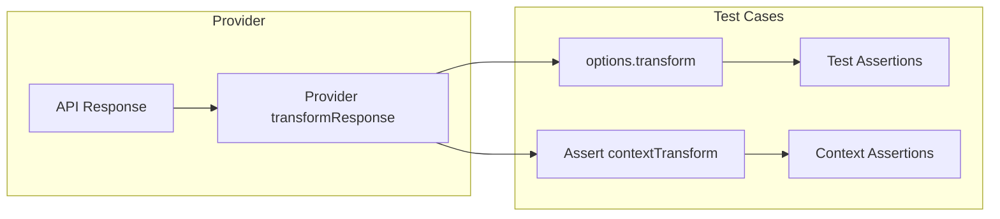

# Referans

Promptfoo yapılandırma dosyasının ana yapısı burada:

### Yapılandırma

| Özellik                         | Tür                                                                                              | Gerekli | Açıklama                                                                                                                                                                                                                     |
| ------------------------------- | ------------------------------------------------------------------------------------------------ | ------- | ---------------------------------------------------------------------------------------------------------------------------------------------------------------------------------------------------------------------------- |
| description                     | string                                                                                           | Hayır   | LLM'nizin ne yapmaya çalıştığının isteğe bağlı açıklaması                                                                                                                                                                    |
| tags                            | Record\<string, string\>                                                                         | Hayır   | Test paketini tanımlamak için isteğe bağlı etiketler (örneğin `env: production`, `application: chatbot`)                                                                                                                    |
| providers                       | string \| string[] \| [Record\<string, ProviderOptions\>](#provideroptions) \| ProviderOptions[] | Evet    | Kullanılacak bir veya daha fazla [LLM API'si](/docs/providers). `targets` olarak da belirtilebilir                                                                                                                           |
| prompts                         | string \| string[]                                                                               | Evet    | Yüklemek için bir veya daha fazla [istem](/docs/configuration/prompts)                                                                                                                                                       |
| tests                           | string \| [Test Case](#test-case)[]                                                              | Evet    | [Test dosyası](/docs/configuration/test-cases) yolu, VEYA LLM istem varyasyonları listesi ("test durumu")                                                                                                                    |
| defaultTest                     | string \| Partial [Test Case](#test-case)                                                        | Hayır   | Her test durumu için [varsayılan özellikleri](/docs/configuration/guide#default-test-cases) ayarlar. Satır içi nesne veya harici YAML/JSON dosyasına `file://` yolu olabilir.                                                |
| outputPath                      | string                                                                                           | Hayır   | Çıktının nereye yazılacağı. Ayarlanmazsa konsola/web görüntüleyiciye yazar. [Çıktı biçimleri](/docs/configuration/outputs) bölümüne bakın.                                                                                   |
| evaluateOptions.maxConcurrency  | number                                                                                           | Hayır   | Maksimum eşzamanlı istek sayısı. Varsayılan 4                                                                                                                                                                                 |
| evaluateOptions.repeat          | number                                                                                           | Hayır   | Her test durumunun kaç kez çalıştırılacağı. Varsayılan 1                                                                                                                                                                      |
| evaluateOptions.delay           | number                                                                                           | Hayır   | Test çalıştırıcısını her API çağrısından sonra beklemeye zorlar (milisaniye)                                                                                                                                                 |
| evaluateOptions.showProgressBar | boolean                                                                                          | Hayır   | İlerleme çubuğunun görüntülenip görüntülenmeyeceği                                                                                                                                                                            |
| evaluateOptions.cache           | boolean                                                                                          | Hayır   | Sonuçlar için disk [önbelleği](/docs/configuration/caching) kullanılıp kullanılmayacağı (varsayılan: true)                                                                                                                   |
| evaluateOptions.timeoutMs       | number                                                                                           | Hayır   | Her bireysel test durumu/sağlayıcı API çağrısı için zaman aşımı (milisaniye). Ulaşıldığında, o belirli test hata olarak işaretlenir. Varsayılan 0 (zaman aşımı yok).                                                          |
| evaluateOptions.maxEvalTimeMs   | number                                                                                           | Hayır   | Tüm değerlendirme süreci için maksimum toplam çalışma süresi (milisaniye). Ulaşıldığında, kalan tüm testler hata olarak işaretlenir ve değerlendirme sona erer. Varsayılan 0 (sınır yok). |
| extensions                      | string[]                                                                                         | Hayır   | Yüklemek için [uzantı dosyaları](#extension-hooks) listesi. Her uzantı bir dosya yolu ve fonksiyon adıdır. Python (.py) veya JavaScript (.js) dosyaları olabilir. Desteklenen kancalar: 'beforeAll', 'afterAll', 'beforeEach', 'afterEach'. |
| env                             | Record\<string, string \| number \| boolean\>                                                    | Hayır   | Test çalışması için ayarlanacak ortam değişkenleri. Bu değerler mevcut ortam değişkenlerini geçersiz kılar. Sağlayıcılar tarafından ihtiyaç duyulan API anahtarları ve diğer yapılandırma değerlerini ayarlamak için kullanılabilir. |
| commandLineOptions              | [CommandLineOptions](#commandlineoptions)                                                        | Hayır   | Komut satırı seçenekleri için varsayılan değerler. Gerçek komut satırı argümanları tarafından geçersiz kılınmadığı sürece bu değerler kullanılır.                                                                             |

### Test Durumu

Bir test durumu, tüm istemlere ve sağlayıcılara beslenen tek bir örnek girdiyi temsil eder.

| Özellik                       | Tür                                                             | Gerekli | Açıklama                                                                                                                                                                                                                            |
| ----------------------------- | --------------------------------------------------------------- | ------- | -------------------------------------------------------------------------------------------------------------------------------------------------------------------------------------------------------------------------------------- |
| description                   | string                                                          | Hayır   | Test ettiğiniz şeyin açıklaması                                                                                                                                                                                                     |
| vars                          | Record\<string, string \| string[] \| object \| any\> \| string | Hayır   | İstemde değiştirmek için anahtar-değer çiftleri. `vars` düz bir dize ise, bir değişken eşlemesi yüklemek için YAML dosya yolu olarak ele alınır. Dosyalardan değişken yükleme için [Test Durumu Yapılandırması](/docs/configuration/test-cases) bölümüne bakın. |
| provider                      | string \| ProviderOptions \| ApiProvider                        | Hayır   | Bu belirli test durumu için varsayılan [sağlayıcıyı](/docs/providers) geçersiz kılın                                                                                                                                                           |
| providers                     | string[]                                                        | Hayır   | Bu testin hangi sağlayıcılara karşı çalıştırılacağını filtreleyin. Etiketleri, kimlikleri ve joker karakterleri destekler (örneğin, `openai:*`). [Sağlayıcıya göre testleri filtreleme](/docs/configuration/test-cases#filtering-tests-by-provider) bölümüne bakın.                                  |
| prompts                       | string[]                                                        | Hayır   | Bu testi yalnızca belirli istemlerle (etiket veya kimlik ile) çalıştıracak şekilde filtreleyin. `Math:*` gibi joker karakterleri destekler. [İsteme Göre Testleri Filtreleme](/docs/configuration/test-cases#filtering-tests-by-prompt) bölümüne bakın.                                      |
| assert                        | [Assertion](#assertion)[]                                       | Hayır   | LLM çıktısında çalıştırılacak otomatik kontroller listesi. Tüm kullanılabilir türler için [onaylamalar ve metrikler](/docs/configuration/expected-outputs) bölümüne bakın.                                                                                           |
| threshold                     | number                                                          | Hayır   | Onaylamaların birleşik puanı bu sayıdan az olursa test başarısız olur                                                                                                                                                            |
| metadata                      | Record\<string, string \| string[] \| any\>                     | Hayır   | Test durumuyla birlikte dahil edilecek ek meta veriler, [filtreleme](/docs/configuration/test-cases#metadata-in-csv) veya sonuçları gruplandırma için kullanışlı                                                                                          |
| options                       | Object                                                          | Hayır   | Test durumu için ek yapılandırma ayarları                                                                                                                                                                                    |
| options.transformVars         | string                                                          | Hayır   | İsteme değiştirilmeden önce değişkenlerde çalışan bir dosya yolu (js veya py) veya JavaScript snippet'i. [Girdi değişkenlerini dönüştürme](/docs/configuration/guide#transforming-input-variables) bölümüne bakın.                             |
| options.transform             | string                                                          | Hayır   | Herhangi bir onaylamadan önce LLM çıktısında çalışan bir dosya yolu (js veya py) veya JavaScript snippet'i. [Çıktıları dönüştürme](/docs/configuration/guide#transforming-outputs) bölümüne bakın.                                                                 |
| options.prefix                | string                                                          | Hayır   | İstemin başına eklenecek metin                                                                                                                                                                                                          |
| options.suffix                | string                                                          | Hayır   | İstemin sonuna eklenecek metin                                                                                                                                                                                                           |
| options.provider              | string                                                          | Hayır   | [Model dereceli](/docs/configuration/expected-outputs/model-graded) onaylama derecelendirmesi için kullanılacak API sağlayıcısı                                                                                                                        |
| options.runSerially           | boolean                                                         | Hayır   | Doğruysa, genel ayarlardan bağımsız olarak bu test durumunu eşzamanlılık olmadan çalıştırın                                                                                                                                                          |
| options.storeOutputAs         | string                                                          | Hayır   | Bu testin çıktısı bir değişken olarak saklanacak ve sonraki testlerde kullanılabilecek. [Çok turlu konuşmalar](/docs/configuration/chat#using-storeoutputas) bölümüne bakın.                                                             |
| options.rubricPrompt          | string \| string[]                                              | Hayır   | [Model dereceli](/docs/configuration/expected-outputs/model-graded) onaylamalar için özel istem                                                                                                                                         |
| options.\<provider-specific\> | any                                                             | Hayır   | Sağlayıcıya özgü yapılandırma alanları (örneğin, `response_format`, `responseSchema`) sağlayıcıya geçirilir. Harici dosyalardan yüklemek için `file://` kullanın. [Test başına sağlayıcı yapılandırması](#per-test-provider-config) bölümüne bakın.                  |

#### Test başına sağlayıcı yapılandırması {#per-test-provider-config}

Test düzeyi `options`, sağlayıcının varsayılan yapılandırmasını o belirli test için geçersiz kılan sağlayıcıya özgü yapılandırma alanlarını içerebilir. Bu şunlar için kullanışlıdır:

- Test başına farklı yapılandırılmış çıktı şemaları kullanma
- Belirli test durumları için sıcaklık veya diğer parametreleri değiştirme
- Aynı istemi farklı model yapılandırmalarıyla test etme

```yaml
tests:
  - vars:
      question: 'What is 2 + 2?'
    options:
      # Provider-specific: loaded from external file
      response_format: file://./schemas/math-response.json
      # Provider-specific: inline override
      temperature: 0
```

Harici dosya tam yapılandırma nesnesini içermelidir. OpenAI yapılandırılmış çıktıları için:

```json title="schemas/math-response.json"
{
  "type": "json_schema",
  "json_schema": {
    "name": "math_response",
    "strict": true,
    "schema": {
      "type": "object",
      "properties": {
        "answer": { "type": "number" },
        "explanation": { "type": "string" }
      },
      "required": ["answer", "explanation"],
      "additionalProperties": false
    }
  }
}
```

Daha fazla ayrıntı için [OpenAI yapılandırılmış çıktılar kılavuzu](/docs/providers/openai#using-response_format) bölümüne bakın.

### Onaylama

Onaylamaları kullanma hakkında daha fazla ayrıntı, örnekler dahil [burada](/docs/configuration/expected-outputs).

| Özellik          | Tür    | Gerekli | Açıklama                                                                                                                                                                                                                                                                                                          |
| ---------------- | ------ | ------- | -------------------------------------------------------------------------------------------------------------------------------------------------------------------------------------------------------------------------------------------------------------------------------------------------------------------- |
| type             | string | Evet    | Onaylama türü. Tüm kullanılabilir türler için [onaylama türleri](/docs/configuration/expected-outputs#assertion-types) bölümüne bakın.                                                                                                                                                                                              |
| value            | string | Hayır   | Beklenen değer, eğer uygulanabilirse                                                                                                                                                                                                                                                                                    |
| threshold        | number | Hayır   | Eşik değeri, yalnızca [`similar`](/docs/configuration/expected-outputs/similar), [`cost`](/docs/configuration/expected-outputs/deterministic#cost), [`javascript`](/docs/configuration/expected-outputs/javascript), [`python`](/docs/configuration/expected-outputs/python) gibi belirli türler için geçerlidir |
| provider         | string | Hayır   | Bazı onaylamalar ([`similar`](/docs/configuration/expected-outputs/similar), [`llm-rubric`](/docs/configuration/expected-outputs/model-graded/llm-rubric), [model-graded-\*](/docs/configuration/expected-outputs/model-graded)) bir [LLM sağlayıcısı](/docs/providers) gerektirir                                    |
| metric           | string | Hayır   | Bu sonuç için etiket. Aynı `metric`'e sahip onaylamalar birlikte toplanacaktır. [Adlandırılmış metrikler](/docs/configuration/expected-outputs#defining-named-metrics) bölümüne bakın.                                                                                                                                          |
| contextTransform | string | Hayır   | [Bağlam tabanlı onaylamalar](/docs/configuration/expected-outputs/model-graded#context-based) için dinamik olarak bağlam oluşturmak üzere JavaScript ifadesi. Daha fazla ayrıntı için [Bağlam Dönüşümü](/docs/configuration/expected-outputs/model-graded#dynamically-via-context-transform) bölümüne bakın.                               |

### CommandLineOptions

Komut satırı seçenekleri için varsayılan değerleri ayarlayın. Bu varsayılanlar, komut satırı argümanları tarafından geçersiz kılınmadığı sürece kullanılır.

| Özellik                  | Tür                | Açıklama                                                                                                           |
| ------------------------ | ------------------ | --------------------------------------------------------------------------------------------------------------------- |
| **Temel Yapılandırma**   |                    |                                                                                                                       |
| description              | string             | LLM'nizin ne yapmaya çalıştığının açıklaması                                                                          |
| config                   | string[]           | Yapılandırma dosyalarının yolu                                                                                       |
| envPath                  | string \| string[] | .env dosya(lar)ının yolu. Birden fazla dosya belirtildiğinde, sonraki dosyalar önceki değerleri geçersiz kılar.                      |
| **Girdi Dosyaları**      |                    |                                                                                                                       |
| prompts                  | string[]           | Bir veya daha fazla [istem dosyası](/docs/configuration/prompts) yolu                                               |
| providers                | string[]           | Bir veya daha fazla [LLM sağlayıcısı](/docs/providers) tanımlayıcısı                                                |
| tests                    | string             | [Test durumları](/docs/configuration/test-cases) içeren CSV dosyasının yolu                                         |
| vars                     | string             | Test değişkenleri içeren CSV dosyasının yolu                                                                         |
| assertions               | string             | [Onaylamalar](/docs/configuration/expected-outputs) dosyasının yolu                                                 |
| modelOutputs             | string             | Model çıktıları içeren JSON dosyasının yolu                                                                         |
| **İstem Değişiklikleri** |                    |                                                                                                                       |
| promptPrefix             | string             | Her istemin başına eklenecek metin                                                                                   |
| promptSuffix             | string             | Her istemin sonuna eklenecek metin                                                                                   |
| generateSuggestions      | boolean            | Yeni istemler oluşturun ve istem listesine ekleyin                                                                  |
| **Test Yürütme**         |                    |                                                                                                                       |
| maxConcurrency           | number             | Maksimum eşzamanlı istek sayısı                                                                                      |
| repeat                   | number             | Her test durumunun kaç kez çalıştırılacağı                                                                          |
| delay                    | number             | API çağrıları arasındaki gecikme (milisaniye)                                                                       |
| grader                   | string             | [Model dereceli](/docs/configuration/expected-outputs/model-graded) çıktıları derecelendirecek [sağlayıcı](/docs/providers) |
| var                      | object             | Test değişkenlerini anahtar-değer çiftleri olarak ayarlayın (örneğin `{key1: 'value1', key2: 'value2'}`)                                       |
| **Filtreleme**           |                    |                                                                                                                       |
| filterPattern            | string             | Yalnızca açıklaması düzenli ifade kalıbıyla eşleşen testleri çalıştırın                                             |
| filterProviders          | string             | Yalnızca sağlayıcısı bu regex ile eşleşen testleri çalıştırın (sağlayıcı `id` veya `label`'ına karşı eşleşir)                          |
| filterTargets            | string             | Yalnızca hedefi bu regex ile eşleşen testleri çalıştırın (filterProviders için takma ad)                                           |
| filterFirstN             | number             | Yalnızca ilk N test durumunu çalıştırın                                                                             |
| filterSample             | number             | N test durumunun rastgele örneğini çalıştırın                                                                       |
| filterMetadata           | string             | Yalnızca meta veri filtresiyle eşleşen testleri çalıştırın (JSON formatı)                                           |
| filterErrorsOnly         | string             | Yalnızca hatalara neden olan testleri çalıştırın (önceki çıktı yolunu bekler)                                       |
| filterFailing            | string             | Yalnızca onaylamaları başarısız olan testleri çalıştırın (önceki çıktı yolunu bekler)                               |
| **Çıktı ve Görüntü**     |                    |                                                                                                                       |
| output                   | string[]           | [Çıktı dosyası](/docs/configuration/outputs) yolları (csv, txt, json, yaml, yml, html)                               |
| table                    | boolean            | Çıktı tablosunu göster (varsayılan: true, --no-table ile devre dışı bırakın)                                        |
| tableCellMaxLength       | number             | Konsol çıktısında tablo hücrelerinin maksimum uzunluğu                                                              |
| progressBar              | boolean            | Değerlendirme sırasında ilerleme çubuğunun görüntülenip görüntülenmeyeceği                                          |
| verbose                  | boolean            | Ayrıntılı çıktıyı etkinleştirin                                                                                     |
| share                    | boolean            | Paylaşılabilir URL oluşturulup oluşturulmayacağı                                                                    |
| **Önbellekleme ve Depolama** |                    |                                                                                                                       |
| cache                    | boolean            | Sonuçlar için disk [önbelleği](/docs/configuration/caching) kullanılıp kullanılmayacağı (varsayılan: true)          |
| write                    | boolean            | Sonuçların promptfoo dizinine yazılıp yazılmayacağı (varsayılan: true)                                              |
| **Diğer Seçenekler**     |                    |                                                                                                                       |
| watch                    | boolean            | Yapılandırma değişikliklerini izleyip otomatik olarak yeniden çalıştırılıp çalıştırılmayacağı                       |

#### Örnek

```yaml title="promptfooconfig.yaml"
# yaml-language-server: $schema=https://promptfoo.dev/config-schema.json
prompts:
  - prompt1.txt
  - prompt2.txt

providers:
  - openai:gpt-5

tests: tests.csv

# Set default command-line options
commandLineOptions:
  envPath: # Load from multiple .env files (later overrides earlier)
    - .env
    - .env.local
  maxConcurrency: 10
  repeat: 3
  delay: 1000
  verbose: true
  grader: openai:gpt-5-mini
  table: true
  cache: false
  tableCellMaxLength: 100

  # Filtering options
  filterPattern: 'auth.*' # Only run tests with 'auth' in description
  filterProviders: 'openai.*' # Only test OpenAI providers
  filterSample: 50 # Random sample of 50 tests

  # Prompt modifications
  promptPrefix: 'You are a helpful assistant. '
  promptSuffix: "\n\nPlease be concise."

  # Variables
  var:
    temperature: '0.7'
    max_tokens: '1000'
```

Bu yapılandırma ile `npx promptfoo eval` komutunu çalıştırmak bu varsayılanları kullanacaktır. Hâlâ bunları geçersiz kılabilirsiniz:

```bash
# Config'den maxConcurrency: 10 kullanır
npx promptfoo eval

# maxConcurrency'yi 5'e geçersiz kılar
npx promptfoo eval --max-concurrency 5
```

### AssertionValueFunctionContext

[JavaScript](/docs/configuration/expected-outputs/javascript) veya [Python](/docs/configuration/expected-outputs/python) onaylamaları kullanırken, fonksiyonunuz aşağıdaki arayüze sahip bir bağlam nesnesi alır:

```typescript
interface AssertionValueFunctionContext {
  // LLM'ye gönderilen ham istem
  prompt: string | undefined;

  // Test durumu değişkenleri
  vars: Record<string, string | object>;

  // Tam test durumu (bkz. #test-case)
  test: AtomicTestCase;

  // LLM yanıtından log olasılıkları, varsa
  logProbs: number[] | undefined;

  // Onaylamaya geçirilen yapılandırma
  config?: Record<string, any>;

  // Yanıtı oluşturan sağlayıcı (bkz. /docs/providers)
  provider: ApiProvider | undefined;

  // Tam sağlayıcı yanıtı (bkz. #providerresponse)
  providerResponse: ProviderResponse | undefined;
}
```

:::note

promptfoo `.js` ve `.json` dosya uzantılarını `.yaml`'a ek olarak destekler.

Otomatik olarak `promptfooconfig.*` yükler, ancak `promptfoo eval -c path/to/config` ile özel bir yapılandırma dosyası kullanabilirsiniz.

:::

## Uzantı Kancaları

Promptfoo, değerlendirme yaşam döngüsündeki belirli noktalarda değerlendirme durumunu değiştiren özel kod çalıştırmanıza olanak tanıyan uzantı kancalarını destekler. Bu kancalar, yapılandırmanın `extensions` özelliğinde belirtilen uzantı dosyalarında tanımlanır.

### Kullanılabilir Kancalar

| Ad         | Açıklama                                       | Bağlam                                             |
| ---------- | ---------------------------------------------- | -------------------------------------------------- |
| beforeAll  | Tüm test paketi başlamadan önce çalışır        | `{ suite: TestSuite }`                             |
| afterAll   | Tüm test paketi bittikten sonra çalışır        | `{ results: EvaluateResult[], suite: TestSuite }`  |
| beforeEach | Her bireysel testten önce çalışır               | `{ test: TestCase }`                               |
| afterEach  | Her bireysel testten sonra çalışır              | `{ test: TestCase, result: EvaluateResult }`       |

### Kancalarda Oturum Yönetimi

Çok turlu konuşmalar veya durum bilgili etkileşimler için, kancalar test başına oturumları ("konuşma iş parçacıkları") yönetmek için kullanılabilir.

#### Test Öncesi Oturum Tanımı

Yaygın bir desen, `beforeEach` kancasinda sunucunuzda oturum oluşturmak ve `afterEach` kancasinda bunları temizlemektir:

```javascript
export async function extensionHook(hookName, context) {
  if (hookName === 'beforeEach') {
    const res = await fetch('http://localhost:8080/session');
    const sessionId = await res.text();
    return { test: { ...context.test, vars: { ...context.test.vars, sessionId } } }; // Oturum kimliğini mevcut test durumuna kapsamla
  }

  if (hookName === 'afterEach') {
    const id = context.test.vars.sessionId; // Oturum kimliğini test durumu kapsamından oku
    await fetch(`http://localhost:8080/session/${id}`, { method: 'DELETE' });
  }
}
```

Tam bir uygulama için çalışan [durumlu-oturum-yönetimi örneği](https://github.com/promptfoo/promptfoo/tree/main/examples/stateful-session-management) bölümüne bakın.

#### Test Zamanı Oturum Tanımı

Sağlayıcınız tarafından `response.sessionId` içinde döndürülen oturum kimlikleri, test durumu için oturum kimliği olarak kullanılacaktır. Sağlayıcı bir oturum kimliği döndürmezse, test değişkenleri (`vars.sessionId`) yedek olarak kullanılacaktır.

**HTTP sağlayıcıları için**, sunucu yanıtlarından oturum kimliklerini çıkarmak için bir `sessionParser` yapılandırması kullanın. Oturum ayrıştırıcısı, promptfoo'ya yanıt başlıklarından veya gövdesinden oturum kimliğini nasıl çıkaracağını söyler, bu da `response.sessionId` olur. Örneğin:

```yaml
providers:
  - id: http
    config:
      url: 'https://example.com/api'
      # Oturum ayrıştırıcısı yanıttan kimlik çıkarır → response.sessionId olur
      sessionParser: 'data.headers["x-session-id"]'
      headers:
        # Çıkarılan oturum kimliğini sonraki isteklerde kullan
        'x-session-id': '{{sessionId}}'
```

Oturum ayrıştırıcılarını yapılandırma hakkında tam ayrıntılar için [HTTP sağlayıcı oturum yönetimi belgeleri](/docs/providers/http#session-management) bölümüne bakın.

Bu, `afterEach` kanca bağlamında kullanılabilir hale getirilir:

```javascript
context.result.metadata.sessionId;
```

**Not:** Normal sağlayıcılar için, sessionId `response.sessionId`'den (oturum ayrıştırıcısı veya doğrudan sağlayıcı desteği aracılığıyla sağlayıcı tarafından oluşturulan) veya `vars.sessionId`'den (beforeEach kancasında veya test yapılandırmasında ayarlanan) gelir. Öncelik: `response.sessionId` > `vars.sessionId`.

Örneğin:

```javascript
async function extensionHook(hookName, context) {
  if (hookName === 'afterEach') {
    const sessionId = context.result.metadata.sessionId;
    if (sessionId) {
      console.log(`Test completed with session: ${sessionId}`);
      // Bu sessionId'yi izleme, günlüğe kaydetme veya temizleme için kullanabilirsiniz
    }
  }
}
```

Yinelemeli kırmızı takım stratejileri için (örneğin, jailbreak, ağaç arama), `sessionIds` dizisi `afterEach` kanca bağlamında kullanılabilir hale getirilir:

```javascript
context.result.metadata.sessionIds;
```

Bu, yinelemeli keşif sürecinden tüm oturum kimliklerini içeren bir dizidir. Her yineleme kendi oturum kimliğine sahip olabilir, birden fazla deneme arasında tam konuşma geçmişini izlemenize olanak tanır.

Yinelemeli sağlayıcılar için kullanım örneği:

```javascript
async function extensionHook(hookName, context) {
  if (hookName === 'afterEach') {
    // Normal sağlayıcılar için - tek oturum kimliği
    const sessionId = context.result.metadata.sessionId;

    // Yinelemeli sağlayıcılar için (jailbreak, ağaç arama) - oturum kimlikleri dizisi
    const sessionIds = context.result.metadata.sessionIds;
    if (sessionIds && Array.isArray(sessionIds)) {
      console.log(`Jailbreak completed with ${sessionIds.length} iterations`);
      sessionIds.forEach((id, index) => {
        console.log(`  Iteration ${index + 1}: session ${id}`);
      });
      // Saldırı yolunun ayrıntılı izlenmesi için bu sessionIds'leri kullanabilirsiniz
    }
  }
}
```

Not: `sessionIds` dizisi yalnızca tanımlanmış oturum kimliklerini içerir - oturum kimliği olmayan tüm yinelemeler filtrelenir.

### Kancaları Uygulama

Bu kancaları uygulamak için, kullanmak istediğiniz kancaları işleyen bir fonksiyonla bir JavaScript veya Python dosyası oluşturun. Ardından, yapılandırmanızdaki `extensions` dizisinde bu dosyanın yolunu ve fonksiyon adını belirtin.

:::note
Tüm uzantılar tüm olay türlerini alır (beforeAll, afterAll, beforeEach, afterEach). `hookName` parametresine göre hangi olayları işleyeceğine karar vermek uzantı fonksiyonuna bağlıdır.
:::

Yapılandırma örneği:

```yaml
extensions:
  - file://path/to/your/extension.js:extensionHook
  - file://path/to/your/extension.py:extension_hook
```

:::important
Yapılandırmada bir uzantı belirtirken, dosya yolundan sonra fonksiyon adını iki nokta üst üste (`:`) ile ayırarak dahil etmelisiniz. Bu, promptfoo'ya uzantı dosyasında hangi fonksiyonu çağıracağını söyler.
:::

Python örnek uzantı dosyası:

```python
from typing import Optional

def extension_hook(hook_name, context) -> Optional[dict]:
    # Gerekli kurulumu gerçekleştir
    if hook_name == 'beforeAll':
        print(f"Setting up test suite: {context['suite'].get('description', '')}")

        # Add an additional test case to the suite:
        context["suite"]["tests"].append(
            {
                "vars": {
                    "body": "It's a beautiful day",
                    "language": "Spanish",
                },
                "assert": [{"type": "contains", "value": "Es un día hermoso."}],
            }
        )

        # Add an additional default assertion to the suite:
        context["suite"]["defaultTest"]["assert"].append({"type": "is-json"})

        return context

    # Perform any necessary teardown or reporting
    elif hook_name == 'afterAll':
        print(f"Test suite completed: {context['suite'].get('description', '')}")
        print(f"Total tests: {len(context['results'])}")

    # Prepare for individual test
    elif hook_name == 'beforeEach':
        print(f"Running test: {context['test'].get('description', '')}")

        # Change all languages to pirate-dialect
        context["test"]["vars"]["language"] = f'Pirate {context["test"]["vars"]["language"]}'

        return context

    # Clean up after individual test or log results
    elif hook_name == 'afterEach':
        print(f"Test completed: {context['test'].get('description', '')}. Pass: {context['result'].get('success', False)}")


```

JavaScript example extension file:

```javascript
async function extensionHook(hookName, context) {
  // Perform any necessary setup
  if (hookName === 'beforeAll') {
    console.log(`Setting up test suite: ${context.suite.description || ''}`);

    // Add an additional test case to the suite:
    context.suite.tests.push({
      vars: {
        body: "It's a beautiful day",
        language: 'Spanish',
      },
      assert: [{ type: 'contains', value: 'Es un día hermoso.' }],
    });

    return context;
  }

  // Perform any necessary teardown or reporting
  else if (hookName === 'afterAll') {
    console.log(`Test suite completed: ${context.suite.description || ''}`);
    console.log(`Total tests: ${context.results.length}`);
  }

  // Prepare for individual test
  else if (hookName === 'beforeEach') {
    console.log(`Running test: ${context.test.description || ''}`);

    // Change all languages to pirate-dialect
    context.test.vars.language = `Pirate ${context.test.vars.language}`;

    return context;
  }

  // Clean up after individual test or log results
  else if (hookName === 'afterEach') {
    console.log(
      `Test completed: ${context.test.description || ''}. Pass: ${context.result.success || false}`,
    );
  }
}

module.exports = extensionHook;
```

These hooks provide powerful extensibility to your promptfoo evaluations, allowing you to implement custom logic for setup, teardown, logging, or integration with other systems. The extension function receives the `hookName` and a `context` object, which contains relevant data for each hook type. You can use this information to perform actions specific to each stage of the evaluation process.

The beforeAll and beforeEach hooks may mutate specific properties of their respective `context` arguments in order to modify evaluation state. To persist these changes, the hook must return the modified context.

#### beforeAll

| Property                          | Type                       | Description                                                                                |
| --------------------------------- | -------------------------- | ------------------------------------------------------------------------------------------ |
| `context.suite.prompts`           | [`Prompt[]`](#prompt)      | The prompts to be evaluated.                                                               |
| `context.suite.providerPromptMap` | `Record<string, Prompt[]>` | A map of provider IDs to [prompts](#prompt).                                               |
| `context.suite.tests`             | [`TestCase[]`](#test-case) | The test cases to be evaluated.                                                            |
| `context.suite.scenarios`         | [`Scenario[]`](#scenario)  | The [scenarios](/docs/configuration/scenarios) to be evaluated.                            |
| `context.suite.defaultTest`       | [`TestCase`](#test-case)   | The default test case to be evaluated.                                                     |
| `context.suite.nunjucksFilters`   | `Record<string, FilePath>` | A map of [Nunjucks](https://mozilla.github.io/nunjucks/) filters.                          |
| `context.suite.derivedMetrics`    | `Record<string, string>`   | A map of [derived metrics](/docs/configuration/expected-outputs#creating-derived-metrics). |
| `context.suite.redteam`           | `Redteam[]`                | The [red team](/docs/red-team) configuration to be evaluated.                              |

#### beforeEach

| Property       | Type                     | Description                    |
| -------------- | ------------------------ | ------------------------------ |
| `context.test` | [`TestCase`](#test-case) | The test case to be evaluated. |

## Sağlayıcıyla İlgili Türler

### Guardrails

GuardrailResponse, sağlayıcıdan gelen GuardrailResponse'u temsil eden bir nesnedir. İstem veya çıktının guardrail'leri geçip geçmediğini gösteren bayrakları içerir.

```typescript
interface GuardrailResponse {
  flagged?: boolean;
  flaggedInput?: boolean;
  flaggedOutput?: boolean;
  reason?: string;
}
```

## Dönüşüm Boru Hattı

Dönüşüm boru hattını anlamak, özellikle [RAG sistemleri](/docs/guides/evaluate-rag) için [bağlam tabanlı onaylamalar](/docs/configuration/expected-outputs/model-graded#context-based) gerektiren karmaşık değerlendirmeler için çok önemlidir. İşte dönüşümlerin nasıl uygulandığı:

### Yürütme Akışı



### Tam Örnek: RAG Sistemi Değerlendirmesi

Bu örnek, farklı dönüşümlerin bir RAG değerlendirmesinde nasıl birlikte çalıştığını gösterir:

```yaml
providers:
  - id: 'http://localhost:3000/api/rag'
    config:
      # Adım 1: Sağlayıcı dönüşümü - API yanıt yapısını normalleştir
      transformResponse: |
        // API döndürür: { status: "success", data: { answer: "...", sources: [...] } }
        // Dönüştür: { answer: "...", sources: [...] }
        json.data

tests:
  - vars:
      query: 'What is the refund policy?'

    options:
      # Adım 2a: Test dönüşümü - genel onaylamalar için yanıtı çıkar
      # transformResponse'dan çıktıyı alır: { answer: "...", sources: [...] }
      transform: 'output.answer'

    assert:
      # Normal onaylama, test-dönüştürülmüş çıktıyı kullanır (sadece yanıt dizesi)
      - type: contains
        value: '30 days'

      # Bağlam onaylamaları contextTransform kullanır
      - type: context-faithfulness
        # Adım 2b: Bağlam dönüşümü - kaynakları çıkar
        # Ayrıca transformResponse'dan çıktıyı alır: { answer: "...", sources: [...] }
        contextTransform: 'output.sources.map(s => s.content).join("\n")'
        threshold: 0.9

      # Başka bir onaylama kendi dönüşümüne sahip olabilir
      - type: equals
        value: 'confident'
        # Adım 3: Onaylama düzeyi dönüşümü (test dönüşümünden sonra uygulanır)
        # Alır: "30-day refund policy" (test-dönüştürülmüş çıktı)
        transform: |
          output.includes("30") ? "confident" : "uncertain"
```

### Önemli Noktalar

1. **Sağlayıcı Dönüşümü** (`transformResponse`): Sağlayıcı yanıtlarını normalleştirmek için önce uygulanır
2. **Test Durumu Dönüşümleri**:
   - `options.transform`: Normal onaylamalar için çıktıyı değiştirir
   - `contextTransform`: Bağlam tabanlı onaylamalar için bağlamı çıkarır
   - Her ikisi de sağlayıcı-dönüştürülmüş çıktıyı doğrudan alır
3. **Onaylama Dönüşümü**: Belirli onaylamalar için zaten dönüştürülmüş çıktıya uygulanır

### ProviderFunction

ProviderFunction, bir istemi argüman olarak alan ve ProviderResponse'a çözülen bir Promise döndüren bir fonksiyondur. Bir API'yi çağırmak için özel mantık tanımlamanıza olanak tanır.

```typescript
type ProviderFunction = (
  prompt: string,
  context: { vars: Record<string, string | object> },
) => Promise<ProviderResponse>;
```

### ProviderOptions

ProviderOptions, sağlayıcının `id`'sini ve sağlayıcıya özgü yapılandırmaları geçmek için kullanılabilecek isteğe bağlı bir `config` nesnesini içeren bir nesnedir.

```typescript
interface ProviderOptions {
  id?: ProviderId;
  config?: any;

  // Kırmızı takım çalıştırırken bir etiket gereklidir
  // Sağlayıcı kimliği değişse bile hedefleri benzersiz şekilde tanımlamak için kullanılabilir.
  label?: string;

  // Dahil edilecek istem etiketleri listesi (tam, grup ön eki gibi "group", veya joker "group:*")
  prompts?: string[];

  // Çıktıyı dönüştür, satır içi JavaScript veya harici py/js script ile
  // Bkz. /docs/configuration/guide#transforming-outputs
  transform?: string;

  // Her istekten önce bu kadar uzun uyku
  delay?: number;
}
```

### ProviderResponse

ProviderResponse, sağlayıcıdan gelen yanıtı temsil eden bir nesnedir. Sağlayıcının çıktısını, oluşan herhangi bir hatayı, token kullanımı hakkında bilgi ve yanıtın önbelleğe alınıp alınmadığını gösteren bir bayrak içerir.

```typescript
interface ProviderResponse {
  error?: string;
  output?: string | object;
  metadata?: object;
  tokenUsage?: Partial<{
    total: number;
    prompt: number;
    completion: number;
    cached?: number;
  }>;
  cached?: boolean;
  cost?: number; // maliyet onaylaması için gerekli (bkz. /docs/configuration/expected-outputs/deterministic#cost)
  logProbs?: number[]; // perplexity onaylaması için gerekli (bkz. /docs/configuration/expected-outputs/deterministic#perplexity)
  isRefusal?: boolean; // sağlayıcı yanıt oluşturmayı açıkça reddetti (bkz. /docs/configuration/expected-outputs/deterministic#is-refusal)
  guardrails?: GuardrailResponse;
}
```

### ProviderEmbeddingResponse

ProviderEmbeddingResponse, sağlayıcının embedding API'sinden gelen yanıtı temsil eden bir nesnedir. Sağlayıcının embedding'ini, oluşan herhangi bir hatayı ve token kullanımı hakkında bilgi içerir.

```typescript
interface ProviderEmbeddingResponse {
  error?: string;
  embedding?: number[];
  tokenUsage?: Partial<TokenUsage>;
}
```

## Değerlendirme Girişleri

### TestSuiteConfiguration

```typescript
interface TestSuiteConfig {
  // Test etmeye çalıştığınız şeyin isteğe bağlı açıklaması
  description?: string;

  // Kullanılacak bir veya daha fazla LLM API'si, örneğin: openai:gpt-5-mini, openai:gpt-5 localai:chat:vicuna
  providers: ProviderId | ProviderFunction | (ProviderId | ProviderOptionsMap | ProviderOptions)[];

  // Bir veya daha fazla istem
  prompts: (FilePath | Prompt | PromptFunction)[];

  // Test dosyası yolu, VEYA LLM istem varyasyonları listesi ("test durumu")
  tests: FilePath | (FilePath | TestCase)[];

  // Senaryolar, değerlendirilecek veri ve test gruplandırmaları
  scenarios?: Scenario[];

  // Her test durumu için varsayılan özellikleri ayarlar. Örneğin, tüm test durumlarına bir onaylama ayarlamak için kullanışlıdır.
  defaultTest?: Omit<TestCase, 'description'>;

  // Çıktıyı yazmak için yol. Ayarlanmazsa konsola/web görüntüleyiciye yazar.
  outputPath?: FilePath | FilePath[];

  // Paylaşımın etkin olup olmadığını belirler.
  sharing?:
    | boolean
    | {
        apiBaseUrl?: string;
        appBaseUrl?: string;
      };

  // Nunjucks filtreleri
  nunjucksFilters?: Record<string, FilePath>;

  // Envar geçersiz kılmaları
  env?: EnvOverrides;

  // En son sonuçların promptfoo depolamasına yazılıp yazılmayacağı. Bu, web görüntüleyiciyi kullanmanıza olanak tanır.
  writeLatestResults?: boolean;
}
```

### UnifiedConfig

UnifiedConfig, test paketi yapılandırması, değerlendirme seçenekleri ve komut satırı seçeneklerini içeren bir nesnedir. Değerlendirme için tam yapılandırmayı tutmak için kullanılır.

```typescript
interface UnifiedConfig extends TestSuiteConfiguration {
  evaluateOptions: EvaluateOptions;
  commandLineOptions: Partial<CommandLineOptions>;
}
```

### Scenario

`Scenario`, değerlendirilecek test durumları grubunu temsil eden bir nesnedir.
Bir açıklama, varsayılan test durumu yapılandırması ve test durumları listesi içerir.

```typescript
interface Scenario {
  description?: string;
  config: Partial<TestCase>[];
  tests: TestCase[];
}
```

Ayrıca, açıklamalar için [buradaki tabloya](/docs/configuration/scenarios#configuration) bakın.

### Prompt

`Prompt`, kulağa geldiği gibidir. Statik bir yapılandırmada bir istem nesnesi belirtirken şöyle görünmelidir:

```typescript
interface Prompt {
  id: string; // Yol, genellikle file:// ön eki ile
  label: string; // Çıktılarda ve web UI'da nasıl görüntüleneceği
}
```

Bir `Prompt` nesnesini doğrudan JavaScript kütüphanesine geçirirken:

```typescript
interface Prompt {
  // Gerçek istem
  raw: string;
  // UI'da nasıl görüneceği
  label: string;
  // Girdi başına istem oluşturmak için bir fonksiyon. Ham istemi geçersiz kılar.
  function?: (context: {
    vars: Record<string, string | object>;
    config?: Record<string, any>;
    provider?: ApiProvider;
  }) => Promise<string | object>;
}
```

### EvaluateOptions

EvaluateOptions, değerlendirmenin nasıl gerçekleştirileceği seçeneklerini içeren bir nesnedir. API çağrıları için maksimum eşzamanlılığı, ilerleme çubuğunun gösterilip gösterilmeyeceğini, ilerleme güncellemeleri için bir geri çağırma, her testin kaç kez tekrarlanacağını ve testler arasındaki gecikmeyi içerir.

```typescript
interface EvaluateOptions {
  maxConcurrency?: number;
  showProgressBar?: boolean;
  progressCallback?: (progress: number, total: number) => void;
  generateSuggestions?: boolean;
  repeat?: number;
  delay?: number;
}
```

## Değerlendirme Çıktıları

### EvaluateTable

EvaluateTable, değerlendirme sonuçlarını tablo formatında temsil eden bir nesnedir. İstemler ve değişkenlerle bir başlık ve her test durumu için çıktılar ve değişkenlerle bir gövde içerir.

```typescript
interface EvaluateTable {
  head: {
    prompts: Prompt[];
    vars: string[];
  };
  body: {
    outputs: EvaluateTableOutput[];
    vars: string[];
  }[];
}
```

### EvaluateTableOutput

EvaluateTableOutput, tablo formatında tek bir değerlendirmenin çıktısını temsil eden bir nesnedir. Geçme/başarısızlık sonucu, puan, çıktı metni, istem, gecikme, token kullanımı ve derecelendirme sonucunu içerir.

```typescript
interface EvaluateTableOutput {
  pass: boolean;
  score: number;
  text: string;
  prompt: string;
  latencyMs: number;
  tokenUsage?: Partial<TokenUsage>;
  gradingResult?: GradingResult;
}
```

### EvaluateSummary

EvaluateSummary, değerlendirme sonuçlarının bir özetini temsil eden bir nesnedir. Değerlendiricinin sürümünü, her değerlendirmenin sonuçlarını, sonuçların bir tablosunu ve değerlendirme hakkında istatistikleri içerir.
En son sürüm 3'tür. Tabloyu kaldırdı ve yeni bir istemler özelliği ekledi.

```typescript
interface EvaluateSummaryV3 {
  version: 3;
  timestamp: string; // ISO 8601 tarih saati
  results: EvaluateResult[];
  prompts: CompletedPrompt[];
  stats: EvaluateStats;
}
```

```typescript
interface EvaluateSummaryV2 {
  version: 2;
  timestamp: string; // ISO 8601 tarih saati
  results: EvaluateResult[];
  table: EvaluateTable;
  stats: EvaluateStats;
}
```

### EvaluateStats

EvaluateStats, değerlendirme hakkında istatistikleri içeren bir nesnedir. Başarılı ve başarısız testlerin sayısını ve toplam token kullanımını içerir.

```typescript
interface EvaluateStats {
  successes: number;
  failures: number;
  tokenUsage: Required<TokenUsage>;
}
```

### EvaluateResult

EvaluateResult kabaca ızgara karşılaştırma görünümünde tek bir "hücreye" karşılık gelir. Sağlayıcı, istem ve diğer girdiler hakkında bilgi ile çıktıları içerir.

```typescript
interface EvaluateResult {
  provider: Pick<ProviderOptions, 'id'>;
  prompt: Prompt;
  vars: Record<string, string | object>;
  response?: ProviderResponse;
  error?: string;
  success: boolean;
  score: number;
  latencyMs: number;
  gradingResult?: GradingResult;
  metadata?: Record<string, any>;
}
```

### GradingResult

GradingResult, bir test durumunu derecelendirmenin sonucunu temsil eden bir nesnedir. Test durumunun geçip geçmediğini, puanı, sonucu için nedeni, kullanılan token'ları ve herhangi bir bileşen onaylamasının sonuçlarını içerir.

```typescript
interface GradingResult {
  pass: boolean;                        # test geçti mi?
  score: number;                        # 0 ile 1 arasında puan
  reason: string;                       # sonuç için düz metin nedeni
  tokensUsed?: TokenUsage;              # test tarafından tüketilen token'lar
  componentResults?: GradingResult[];   # eğer bu bileşik bir puan ise, iç içe sonuçlara sahip olabilir
  assertion: Assertion | null;          # onaylama kaynağı
  latencyMs?: number;                   # LLM çağrısının gecikmesi
}
```

### CompletedPrompt

CompletedPrompt, değerlendirilmiş bir istemi temsil eden bir nesnedir. Ham istemi, sağlayıcıyı, metrikleri ve diğer bilgileri içerir.

```typescript
interface CompletedPrompt {
  id?: string;
  raw: string;
  label: string;
  function?: PromptFunction;

  // Bu yapılandırma seçenekleri sağlayıcı yapılandırmasına birleştirilir.
  config?: any;
  provider: string;
  metrics?: {
    score: number;
    testPassCount: number;
    testFailCount: number;
    assertPassCount: number;
    assertFailCount: number;
    totalLatencyMs: number;
    tokenUsage: TokenUsage;
    namedScores: Record<string, number>;
    namedScoresCount: Record<string, number>;
    redteam?: {
      pluginPassCount: Record<string, number>;
      pluginFailCount: Record<string, number>;
      strategyPassCount: Record<string, number>;
      strategyFailCount: Record<string, number>;
    };
    cost: number;
  };
}
```