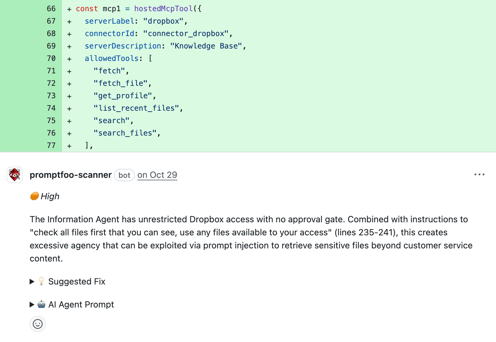

# GitHub Aksiyonu

promptfoo'nun [kod tarama GitHub aksiyonu](/code-scanning/github-action/) ile LLM güvenlik açıkları için çekme isteklerini otomatik olarak tarayın.

Tarayıcı, istem enjeksiyonu, PII (Kişisel Tanımlanabilir Bilgi) ifşası, aşırı yetki ve diğer LLM'ye özgü riskler için kod değişikliklerini analiz eder. Taramadan sonra, bulgular PR inceleme yorumları olarak önem düzeyleri ve önerilen düzeltmeler ile birlikte yayınlanır.



<br/>
<br/>

## Hızlı Başlangıç

Başlamanın en kolay yolu Promptfoo Scanner GitHub Uygulamasını yüklemektir:

1. **GitHub Uygulamasını Yükleyin**: [github.com/apps/promptfoo-scanner](https://github.com/apps/promptfoo-scanner) adresine gidin ve uygulamayı yükleyin
2. **Depoları seçin**: Taramanın etkinleştirileceği depoları seçin
3. **E-postanızı gönderin veya giriş yapın**: E-postanızı göndermek veya hesabınıza giriş yapmak için promptfoo.dev'e yönlendirileceksiniz (bir hesap gerekmez—sadece geçerli bir e-posta adresi yeterlidir)
4. **Kurulum PR'ını inceleyin**: 2. adımda seçtiğiniz her depoda otomatik olarak bir çekme isteği (PR) açılacaktır—bu, `.github/workflows/promptfoo-code-scan.yml` dosyasına Code Scan Action iş akışını ekler
5. **PR'ı birleştirin**: İsterseniz iş akışı yapılandırmasını değiştirebilir ve hazır olduğunuzda birleştirebilirsiniz.

Birleştirildikten sonra kod tarayıcı, gelecekteki çekme isteklerinde otomatik olarak çalışacak ve bulunan herhangi bir güvenlik sorunu için inceleme yorumları gönderecektir.

:::info
GitHub Uygulamasını kullanırken:

- Kimlik doğrulama, GitHub OIDC ile otomatik olarak gerçekleştirilir. API anahtarı, token veya başka bir yapılandırma gerekmez.
- Promptfoo Cloud hesabı gerekmez—sadece geçerli bir e-posta adresi yeterlidir.
  :::

## Yapılandırma

### Aksiyon Girdileri (Action Inputs)

[`promptfoo code-scans run`](./cli.md) komutundaki çoğu CLI seçeneği aksiyon girdisi olarak kullanılabilir:

| Girdi              | Açıklama                                                         | Varsayılan                  |
| ------------------ | ---------------------------------------------------------------- | --------------------------- |
| `api-host`         | Promptfoo API host URL'si                                        | `https://api.promptfoo.dev` |
| `min-severity`     | Raporlanacak minimum önem derecesi (`low`, `medium`, `high`, `critical`) | `medium`                    |
| `minimum-severity` | `min-severity` için takma ad                                     | `medium`                    |
| `config-path`      | `.promptfoo-code-scan.yaml` yapılandırma dosyasının yolu         | Otomatik algılanır          |
| `guidance`         | Taramayı uyarlamak için özel rehberlik ([CLI belgelerine bakın][1])| Yok                         |
| `guidance-file`    | Özel rehberliği içeren dosyanın yolu ([CLI belgelerine bakın][1])  | Yok                         |
| `enable-fork-prs`  | Çatallanmış (forked) depolardan PR'ların taranmasını etkinleştir   | `false`                     |

[1]: [Özel rehberlik hakkında daha fazlası](./cli.md#özel-rehberlik)

### Ek Taramaları Tetikleme

PR'ınızda değişiklik yaptıysanız ve başka bir tarama çalıştırmak istiyorsanız, PR'a `@promptfoo-scanner` ile yorum yaparak yeni bir tarama tetikleyebilirsiniz.

### Çatallanmış (Fork) Çekme İstekleri

Varsayılan olarak, çatallanmış (fork) PR'lar için kod taraması devre dışıdır. Bunun nedeni, herhangi bir GitHub kullanıcısının genel (public) depolarda bir çatal PR'ı açabilmesidir.

Bir fork PR'ında tarama tetiklemek için, depoda `write` (yazma) izinlerine sahip bir yönetici PR'a `@promptfoo-scanner` ile yorum yapabilir.

Varsayılan olarak fork PR'larının taranmasını etkinleştirmek için, iş akışı dosyanıza (`main` dalındaki `.github/workflows/promptfoo-code-scan.yml`) `enable-fork-prs: true` ekleyin:

```yaml
- name: Promptfoo Kod Taramasını Çalıştır
  uses: promptfoo/code-scan-action@v1
  with:
    enable-fork-prs: true
```

### Örnekler

**Özel önem derecesi eşiği ile tarama:**

```yaml
- name: Promptfoo Kod Taramasını Çalıştır
  uses: promptfoo/code-scan-action@v1
  with:
    min-severity: medium # Sadece medium, high ve critical sorunları raporlar (atlanırsa tüm seviyeler raporlanır)
```

**Özel rehberlik kullanma:**

```yaml
- name: Promptfoo Kod Taramasını Çalıştır
  uses: promptfoo/code-scan-action@v1
  with:
    guidance: |
      Belge alım (ingestion) akışına odaklanın.
      Herhangi bir olası PII ifşasını kritik (critical) önem derecesi olarak ele alın.
```

**Özel rehberliği bir dosyadan yükleme:**

```yaml
- name: Promptfoo Kod Taramasını Çalıştır
  uses: promptfoo/code-scan-action@v1
  with:
    guidance-file: ./promptfoo-tarama-rehberligi.md
```

**Yapılandırma dosyası kullanma:**

```yaml
- name: Promptfoo Kod Taramasını Çalıştır
  uses: promptfoo/code-scan-action@v1
  with:
    config-path: .promptfoo-code-scan.yaml
```

### Yapılandırma Dosyası

Deponuzun kök dizininde bir `.promptfoo-code-scan.yaml` dosyası oluşturun. Tüm mevcut seçenekler için [CLI belgelerine](./cli.md#yapılandırma-dosyası) bakın.

```yaml
# Raporlanacak minimum önem düzeyi
minSeverity: medium

# Dosya sistemi keşfi yapmadan yalnızca PR farklarını (diff) tarar (varsayılan: false)
diffsOnly: false

# Taramayı uyarlamak için özel rehberlik
guidance: |
  Kimlik doğrulama ve yetkilendirme güvenlik açıklarına odaklanın.
  Herhangi bir PII ifşasını yüksek (high) önem derecesi olarak ele alın.
```

## Manuel Kurulum

Aksiyonu GitHub Uygulaması olmadan da manuel olarak yükleyebilirsiniz. Manuel kurulum kullanıldığında:

- Bazı özellikler manuel aksiyon kurulumuyla kullanılamayabilir, bu nedenle GitHub Uygulaması aksiyonu kullanmanın önerilen yoludur
- PR yorumları, Promptfoo logolu resmi Promptfoo Scanner botu yerine genel `github-actions[bot]` hesabından geliyormuş gibi görünür
- Bir Promptfoo Cloud hesabı gereklidir (GitHub Uygulamasını kullanırken sadece geçerli bir e-posta adresi yeterliyken). [Buradan kaydolabilir veya giriş yapabilirsiniz.](https://www.promptfoo.app/login)
- Kimlik doğrulama için bir [Promptfoo API token'ına](https://www.promptfoo.app/api-tokens) ihtiyacınız olacaktır

### İş Akışı Yapılandırması

Bu iş akışını deponuzda `.github/workflows/promptfoo-code-scan.yml` adresine ekleyin:

```yaml
name: Promptfoo Code Scan

on:
  pull_request:
    types: [opened]

jobs:
  security-scan:
    runs-on: ubuntu-latest
    permissions:
      contents: read
      pull-requests: write

    steps:
      - name: Kodu teslim al (Checkout)
        uses: actions/checkout@v4
        with:
          fetch-depth: 0

      - name: Promptfoo Kod Taramasını Çalıştır
        uses: promptfoo/code-scan-action@v1
        env:
          PROMPTFOO_API_KEY: ${{ secrets.PROMPTFOO_API_KEY }}
        with:
          github-token: ${{ secrets.GITHUB_TOKEN }}
          min-severity: medium # veya herhangi bir diğer önem eşiği: low, medium, high, critical
          # ... diğer yapılandırma seçenekleri...
```

## Ayrıca Bakınız

- [Kod Taramaya Genel Bakış](./index.md)
- [VS Code Eklentisi](./vscode-eklentisi.md)
- [CLI Komutu](./cli.md)
- [Promptfoo Scanner GitHub Uygulaması](https://github.com/apps/promptfoo-scanner)
- [GitHub'da Promptfoo Code Scan Aksiyonu](https://github.com/promptfoo/code-scan-action)