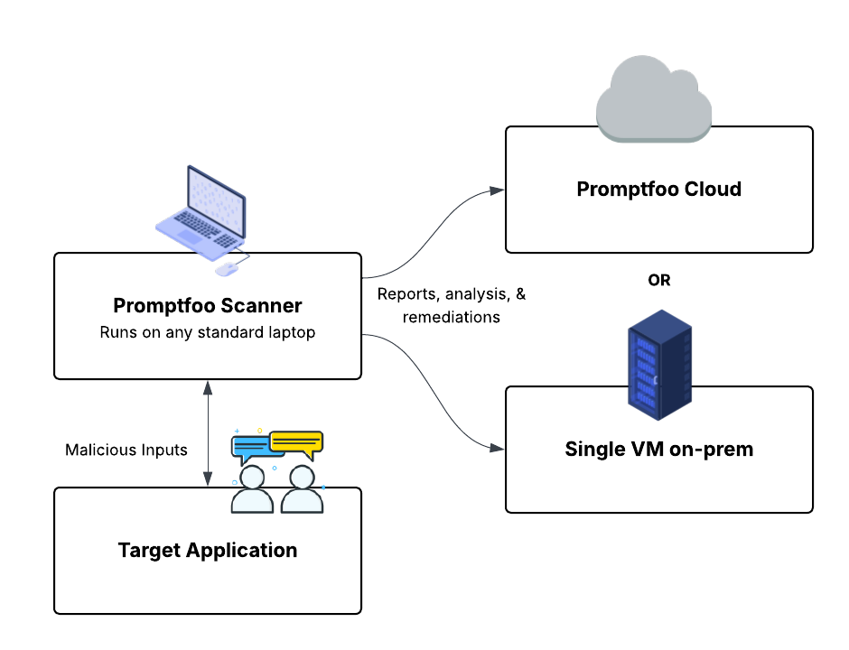

# Promptfoo Enterprise

Promptfoo, güvenlik ihtiyaçlarınızı karşılamak için iki dağıtım seçeneği sunar:

**Promptfoo Enterprise**, altyapı yönetimi gerekmeden LLM uygulamalarınızı güvenli bir şekilde taramanıza olanak tanıyan barındırılan SaaS çözümümüzdür.

**Promptfoo Enterprise Şirket İçi**, güvenlik duvarınızın arkasındaki dağıtımlar için özel bir çalıştırıcı içeren şirket içi çözümümüzdür.

Her iki çözüm de LLM uygulamalarınızı güvence altına almanıza yardımcı olacak bir araç paketi sunar:

- Birden fazla kullanıcı ve takımı yönetmek için sağlam RBAC kontrolleri
- Hedefleri, eklentileri ve tarama yapılandırmalarını özelleştirmek için takım tabanlı yapılandırılabilirlik
- LLM uygulamalarınızın güvenliğini izlemek için ayrıntılı raporlama ve analitik
- Güvenlik açıklarını düzeltmenize yardımcı olacak iyileştirme önerileri
- Değerlendirmeleri bulmak ve sıralamak için gelişmiş filtreleme
- Promptfoo'yu mevcut araçlarınızla entegre etmek için paylaşma ve dışa aktarma işlevleri

Platformumuz, çıkarım için hazır ve canlı olan herhangi bir LLM uygulaması, ajanı veya temel modelle çalışır.

## Dağıtım Seçenekleri

İki dağıtım modeli sunuyoruz:

- **Promptfoo Enterprise**: Promptfoo tarafından yönetilen, altyapı gereksinimi olmadan hemen başlamanıza olanak tanıyan tam yönetimli SaaS çözümümüz.

- **Promptfoo Enterprise Şirket İçi**: AWS, Azure ve GCP dahil herhangi bir bulut sağlayıcısında dağıtılabilen, kendi barındırdığınız çözümümüz. Ağ çevreniz içinde taramaları yürütmek için özel bir çalıştırıcı bileşeni içerir.

## Ürün Karşılaştırması

| Özellik                                                 | Topluluk                        | Promptfoo Enterprise                         | Promptfoo Enterprise Şirket İçi              |
| -------------------------------------------------------- | ------------------------------- | -------------------------------------------- | -------------------------------------------- |
| Takım Yönetimi                                           | ❌                              | ✅                                           | ✅                                           |
| Sonuç Paylaşımı                                          | ⚠️ | ✅                                           | ✅                                           |
| SLA                                                      | ❌                              | ✅                                           | ✅                                           |
| Red Teaming                                              | ⚠️ | ✅                                           | ✅                                           |
| RBAC                                                     | ❌                              | ✅                                           | ✅                                           |
| Özel Çalıştırıcı                                        | ❌                              | ❌                                           | ✅                                           |
| Model ve Uygulama Değerlendirmeleri                      | ✅                              | ✅                                           | ✅                                           |
| İyileştirmeler                                           | ⚠️ | ✅                                           | ✅                                           |
| Harici Entegrasyonlar (SIEM'ler, Sorun takipçileri, vb.) | ❌                              | ✅                                           | ✅                                           |
| Güvenlik Açığı Tespiti                                   | ✅                              | ✅                                           | ✅                                           |
| Destek                                                   | Topluluk Sohbeti + Github Sorunları | Tam Profesyonel Hizmetler + Özel Slack   | Tam Profesyonel Hizmetler + Özel Slack       |
| Dağıtım                                                 | Komut satırı aracı              | Tam yönetimli SaaS                           | Kendi barındırma, şirket içi                 |
| API Erişimi                                              | ⚠️ | [✅](/docs/api-reference)                    | [✅](/docs/api-reference)                    |
| Altyapı                                                 | Yerel                           | Promptfoo tarafından yönetilir               | Ekibiniz tarafından yönetilir                |
| Ağ İzolasyonu                                           | ❌                              | ❌                                           | ✅                                           |

<small>⚠️ Topluluk sürümünde sınırlı miktarı gösterir. Daha fazla bilgi için [bize ulaşın](/contact/).</small>

Her iki Enterprise ürünü de paylaşılabilir URL'ler aracılığıyla [sonuç paylaşımını](/docs/usage/sharing) destekler ve dağıtım modelinize uygun gizlilik kontrolleri sunar. Enterprise kullanıcıları organizasyonları içinde paylaşabilirken, Enterprise Şirket İçi kullanıcıları veriler üzerinde tam kontrol için kendi barındırdıkları paylaşımı yapılandırabilir.

## Açık Kaynak ile Bağlantı

Hem Promptfoo Enterprise hem de Promptfoo Enterprise Şirket İçi, Promptfoo'nun açık kaynak sürümüyle tamamen uyumludur. Bu, mevcut açık kaynak Promptfoo sonuçlarınızı her iki çözümle de kullanabileceğiniz anlamına gelir.

## Daha fazla bilgi

Promptfoo Enterprise hakkında daha fazla bilgi edinmek istiyorsanız, lütfen [bize ulaşın](/contact/).
