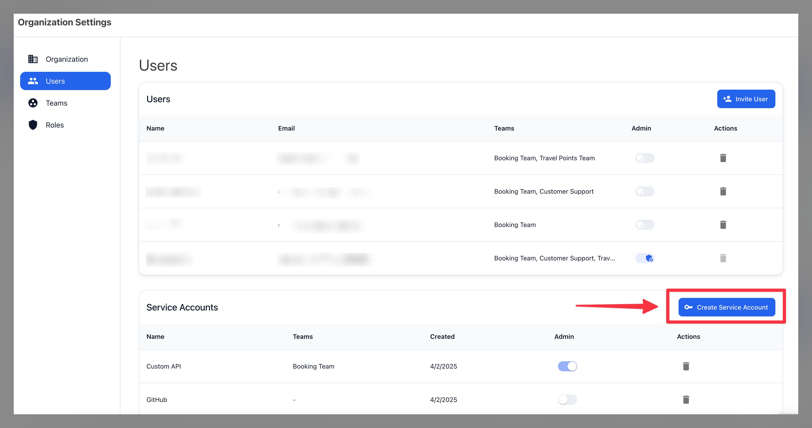
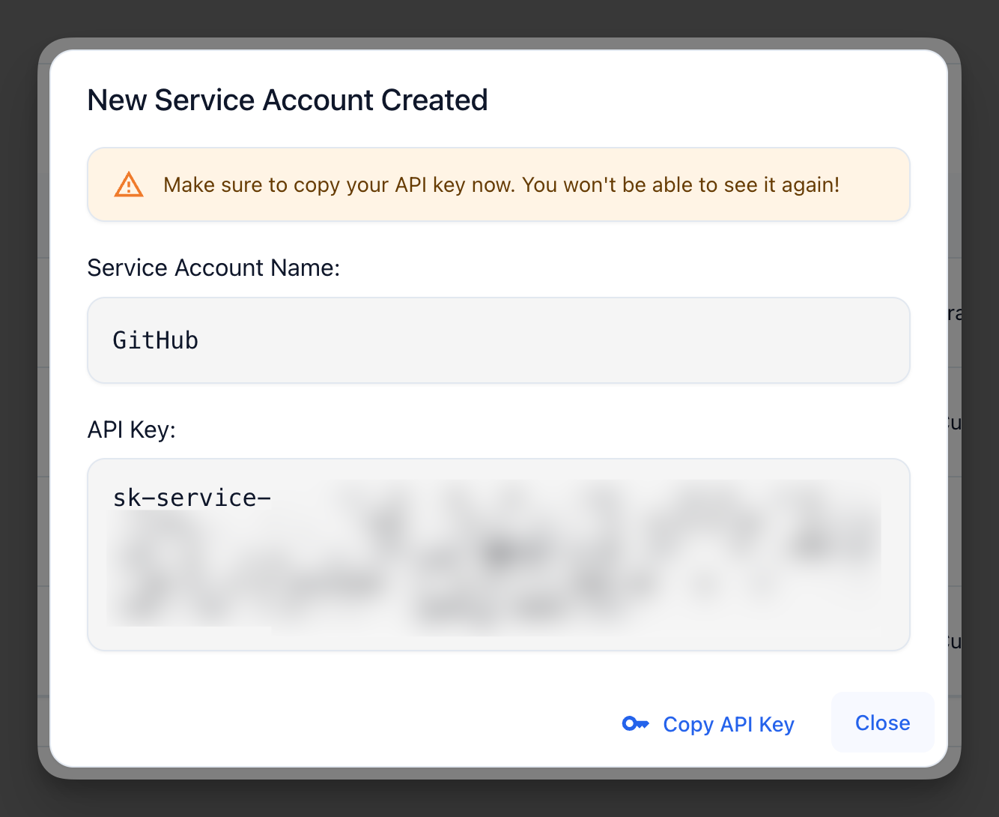
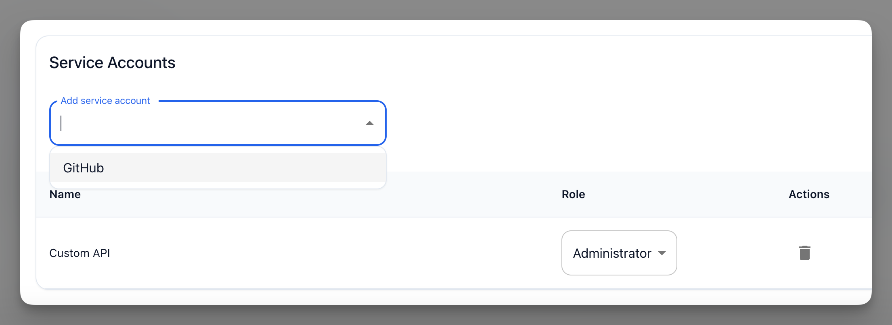

# Hizmet Hesapları

Hizmet hesapları, [Promptfoo Enterprise](/docs/enterprise/)'a programatik erişim için API anahtarları oluşturmanıza olanak tanır. Bunlar CI/CD pipeline'ları ve otomatik testler için kullanışlıdır.

:::note
Yalnızca genel sistem yöneticileri hizmet hesapları oluşturabilir ve atayabilir.
:::

Bir hizmet hesabı oluşturmak için:

1. Organizasyon Ayarları sayfanıza gidin
2. "Kullanıcılar" sekmesine tıklayın ve ardından "Hizmet Hesabı Oluştur"u seçin

    

3. Hizmet hesabınız için bir ad girin ve API anahtarını güvenli bir konuma kaydedin.

    

:::warning
API anahtarınızı ilk oluşturulduğunda kopyaladığınızdan emin olun. Güvenlik nedeniyle, iletişim kutusunu kapattıktan sonra tekrar görüntüleyemezsiniz.
:::
4. API anahtarına genel yönetici ayrıcalıkları atamak isteyip istemediğinizi belirleyin. Bu, API anahtarına organizasyon ayarları sayfasında yapılabilecek her şeye — takımları, rolleri, kullanıcıları ve webhook'ları yönetme gibi — erişim sağlayacaktır.
5. "Takımlar" sekmesine gidip "Hizmet Hesapları" bölümünde API anahtarını atamak istediğiniz takımı seçerek API anahtarını bir takıma atayın. Hizmet hesabı API anahtarları, bir takıma ve role atanmadıkça Promptfoo Enterprise'a programatik erişime sahip olmayacaktır.

    

6. O takım için hizmet hesabının önceden tanımlanmış rolünü seçin.

## Ayrıca Bakınız

- [Rolleri ve Takımları Yönetme](./takimlar.md)
- [Kimlik Doğrulama](./kimlik-dogrulama.md)
