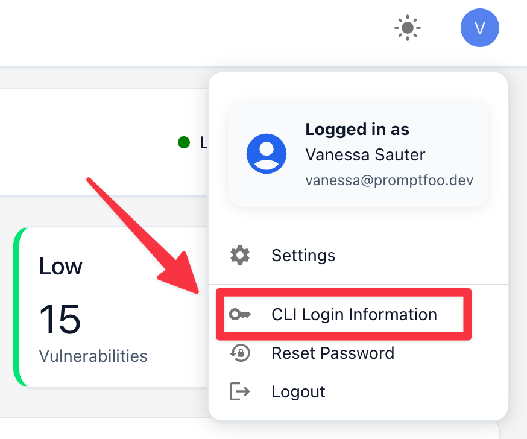
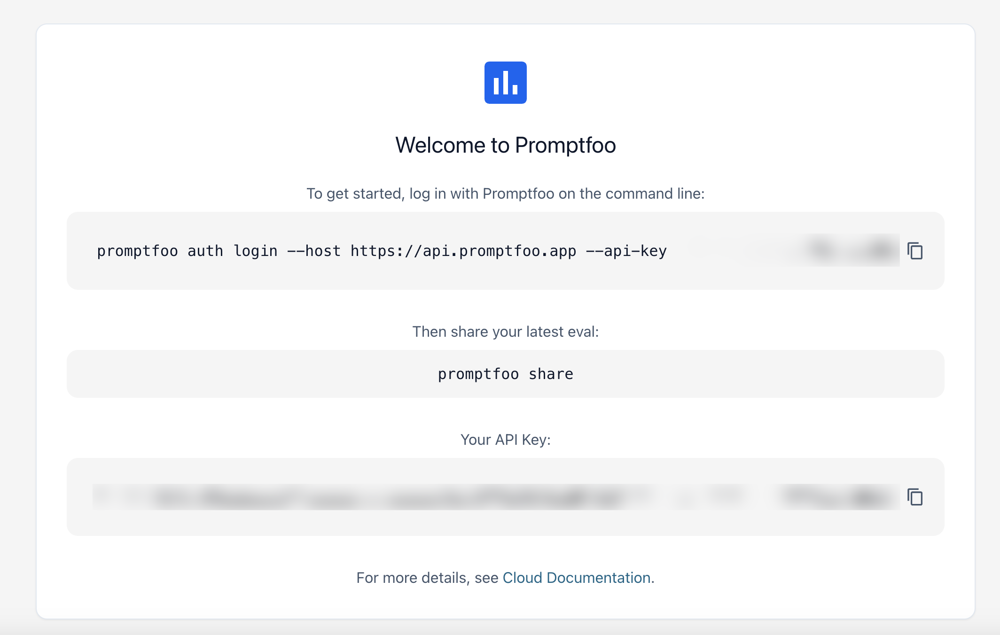

# Kimlik Doğrulama

## SSO Kurulumu

[Promptfoo Enterprise](/docs/enterprise/), SAML 2.0 ve OIDC aracılığıyla hem temel kimlik doğrulamayı hem de SSO'yu destekler. Promptfoo Enterprise ile SSO yapılandırmak için, IdP bilgilerinizle destek ekibine ulaşın ve Promptfoo ekibi yapılandırmayı gerçekleştirecektir. Kimlik doğrulama uç noktası `auth.promptfoo.app`'tir.

## Temel Kimlik Doğrulama

Promptfoo Enterprise, `auth.promptfoo.app` üzerinden uygulamaya temel kimlik doğrulamayı destekler. Bir organizasyon oluşturulduğunda, genel yönetici giriş yapmak için Promptfoo Enterprise'dan bir e-posta alacaktır. Kullanıcılar, takımlar ve roller, Promptfoo Enterprise uygulamasının Organizasyon Ayarları bölümünde oluşturulacaktır; bu konu [Takımlar belgelerinde](./takimlar.md) daha ayrıntılı anlatılmaktadır.

Ayrıca sihirli bağlantı kullanarak da uygulamaya kimlik doğrulaması yapabilirsiniz. Bunu yapmak için `auth.promptfoo.app` adresine gidin ve "Sihirli bağlantıyla giriş yap" düğmesine tıklayın. Giriş yapmak için bir bağlantı içeren bir e-posta alacaksınız. E-posta almadıysanız, lütfen spam klasörünüzü kontrol ettiğinizden emin olun.

## CLI'ya Kimlik Doğrulama

Promptfoo Enterprise kullanırken CLI'ya kimlik doğrulaması yapmak isteyebilirsiniz. Promptfoo Enterprise'ı CLI'ya bağlamak için şu adımları izleyin.

1. Promptfoo CLI'yı yükleyin. CLI'yı yüklemek için yardım almak üzere [başlarken](/docs/getting-started/) sayfasını okuyun.

2. Promptfoo Enterprise uygulamasında, profilinizin altındaki "CLI Giriş Bilgileri"ni seçin.



3. İlk komutu kopyalayın ve CLI'nızda çalıştırın. CLI'nız artık Promptfoo Enterprise'a kimlik doğrulaması yapacak ve yerel olarak çalıştırılan değerlendirme sonuçlarını paylaşmanıza olanak tanıyacaktır.



4. Kimlik doğrulaması yapıldıktan sonra, değerlendirme sonuçlarını Promptfoo Enterprise organizasyonunuzla paylaşmak için `promptfoo eval --share` veya `promptfoo share` komutlarını çalıştırabilirsiniz.

:::tip
Tüm değerlendirmeleriniz paylaşana kadar yerel olarak saklanır. Daha önce açık kaynak kullanıcısıysanız, yerel değerlendirmelerinizi `promptfoo share` komutunu çalıştırarak Promptfoo Enterprise organizasyonunuzla paylaşabilirsiniz.
:::

Organizasyonunuzun hesabıyla kimlik doğrulaması yapmak, [takım tabanlı paylaşımı](/docs/usage/sharing#enterprise-sharing) etkinleştirerek değerlendirme sonuçlarınızın herkese açık olması yerine yalnızca organizasyonunuzun üyelerine görünür olmasını sağlar.

## Birden Fazla Takımla Çalışma

Organizasyonunuzda birden fazla takım varsa, hangi takım bağlamında çalıştığınızı yönetebilirsiniz:

### Takımlarınızı Görüntüleme

```sh
# Erişiminiz olan tüm takımları listeleyin
promptfoo auth teams list
```

Bu komut, mevcut takımınızın yanında bir işaret (●) ile tüm kullanılabilir takımları gösterir.

### Takım Değiştirme

```sh
# Farklı bir takıma geçin
promptfoo auth teams set "Data Science"
```

Takım adını, slug'ını veya ID'sini kullanabilirsiniz. Seçiminiz CLI oturumları arasında kalıcıdır.

### Mevcut Takımı Kontrol Etme

```sh
# Aktif takımınızı görüntüleyin
promptfoo auth teams current
```

Siz farklı bir takıma geçene kadar tüm işlemler (değerlendirmeler, red team taramaları vb.) bu takım bağlamını kullanacaktır.
