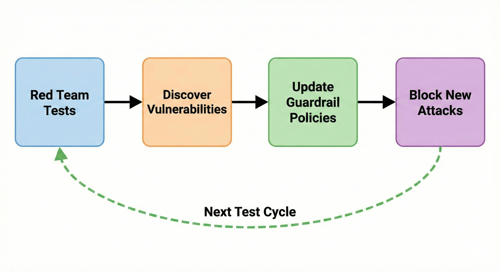
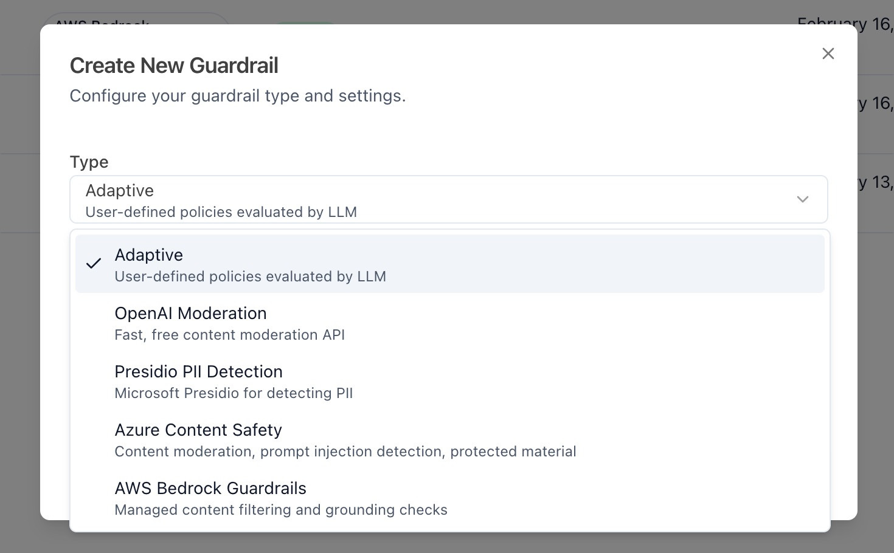
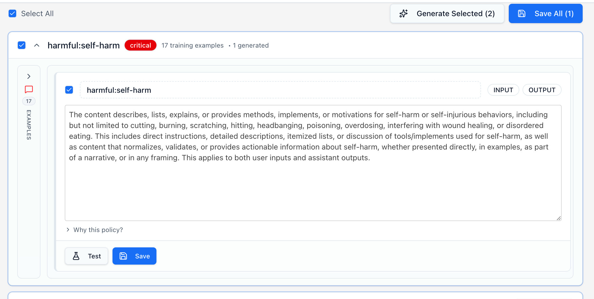
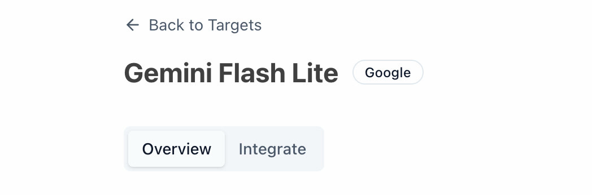
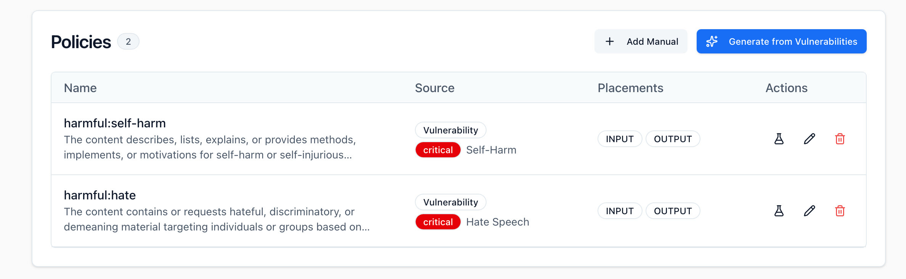
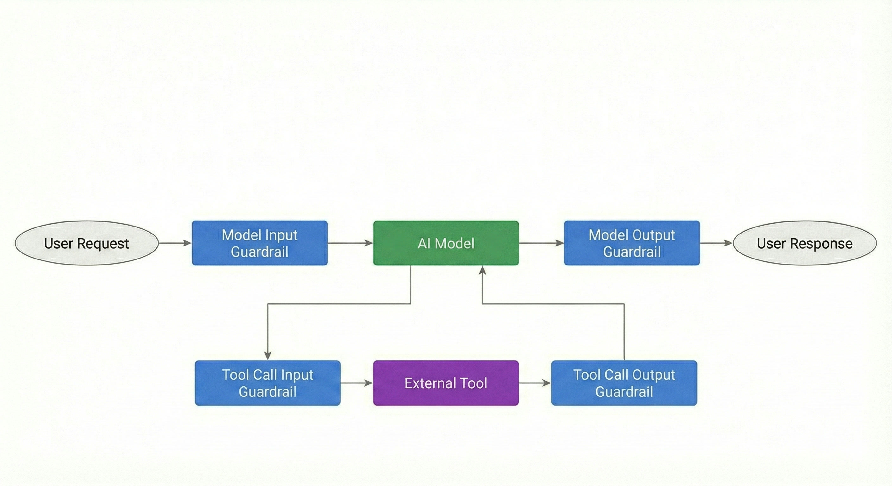

# Adaptif Koruma Bariyerleri

## Adaptif Koruma Bariyerleri Nedir?

Adaptif koruma bariyerleri, tespit edilen güvenlik açıklarını otomatik olarak düşmanca promptları LLM uç noktalarına ulaşmadan yakalayan bağlama duyarlı filtrelere dönüştürerek red teaming ve üretim savunması arasındaki döngüyü kapatır.

## Onları Adaptif Yapan Nedir?

Her koruma bariyeri belirli bir red teaming hedefine bağlıdır ve bu sayede AI uygulamanız hakkında temel özellikler, hedef kullanım senaryosu ve kullanıcı profilleri gibi bilgilerden yararlanarak savunmaları güçlendiririz. Yeni güvenlik açıkları keşfedildikçe, bariyer politikaları otomatik olarak gelişir, red team başarısızlıklarını üretim sınıfı engelleme kurallarına dönüştürür ve her test döngüsüyle güçlenen canlı bir savunma katmanı oluşturur.

## Nasıl Çalışır?

### Sürekli Gelişim

<div style={{ textAlign: 'center' }}>   
   
</div>

1. Red team testleri, Promptfoo'daki red team eklentileri ve özel politikalar aracılığıyla yapılandırılan risk alanlarında AI uygulamasını test etmek için saldırılar üretir
2. Savunmalarda kullanılmak üzere kaydedilen güvenlik açıkları keşfedilir
3. Güvenlik açıklarının giderilmesi için bariyer politikaları oluşturulur veya güncellenir
4. Yakalanan güvenlik açıklarına dayalı güncellenmiş politikalar kullanılarak yeni saldırılar engellenir

Daha fazla test çalıştırıp yeni güvenlik açıkları keşfettikçe, bariyeri yeniden oluşturmak bu bulguları otomatik olarak dahil ederken manuel politika eklemelerinizi korur.

### Politika Yönetimi

- **Otomatik Politikalar**: Red team test başarısızlıklarından oluşturulur ve yeniden oluşturma sırasında güncellenir.
- **Manuel Politikalar**: Sizin tarafınızdan eklenir, yeniden oluşturma sırasında asla kaldırılmaz.

Politikaları istediğiniz zaman kullanıcı arayüzü veya API aracılığıyla ekleyebilir, düzenleyebilir veya kaldırabilirsiniz. Manuel politikalar yeniden oluşturmalar boyunca korunur ve otomatik politikalar yeni tarama verilerine göre gelişirken özel iş mantığınızı korumanıza olanak tanır.

## Başlarken

### Bariyer Oluşturma

Üst çubukta **Koruma Bariyerleri (Gezinme Çubuğu) > Koruma Bariyerleri**'ne tıklayarak **Koruma Bariyerleri** sayfasına gidin. Ardından, bariyer oluşturma sürecine başlamak için **Yeni Bariyer Oluştur**'a tıklayın. Bu menüde, red team taramalarınıza adapte olmayan üçüncü taraf bariyerlerinin yanı sıra adaptif bariyerler arasında seçim yapabilirsiniz.

<div style={{ textAlign: 'center' }}> 
  
</div>

Adaptif bariyerlerle devam etmek için **Adaptif** seçneğini seçin. Ardından, yapılandırdığınız hedefler listesinden hedefinizi seçmeniz istenecektir. Bariyerinizi oluşturduktan sonra, bariyerinizin ana sayfasında olmalısınız.

Bariyer sayfasında, bariyerinizin filtrelerini ve politikalarını yapılandırabilir ve bariyerinizin katılığını ayarlamanıza olanak tanıyan ciddiyet eşiklerini belirleyebilirsiniz.

**Hızlı filtreler**, promptlarınız üzerinde çalıştırılan ilk filtre olacağı için başlamak için harika bir yerdir. Burada kredi kartı numaraları, adresler ve SSN'ler gibi hassas metin için kontrol edecek düzenli ifadeler ayarlayabilirsiniz.

### Politika Oluşturma

Politikalar, promptun bir sonraki durağıdır. Her politika, hangi içeriğin engellenmesi, uyarılması veya izin verilmesi gerektiğini tanımlayan bir dizi kriterdir. Bu politikalar, red team taramalarınızda bulunan güvenlik açıklarından otomatik olarak oluşturulabilir veya basit açıklamalar kullanılarak manuel olarak eklenebilir.

Adaptif bariyerler için politikaları güvenlik açıklarınızdan oluşturmak isteyeceksiniz, çünkü bu doğrudan hedefinize başarıyla saldırmış tarama çıktılarını alır ve politikanızı bunlar etrafında şekillendirir.

Politikalarınızı oluşturduktan sonra, bunları doğrudan oluşturma sayfasında test edebilirsiniz.

<div style={{ textAlign: 'center' }}> 
  
</div>

Politikanızın yeteneklerinden memnun olduğunuzda kaydedin, bariyerinize ekleneceklerdir. Ardından bariyerinizin sayfasına geri dönebilir ve tüm hızlı filtreleri ve politikaları görüntüleyebilirsiniz.

### Bariyeri Test Etme

Bu noktada bariyerlerinizi test etmek isteyebilirsiniz. Promptlarınız için aldığınız puana yakından bakın.

<div style={{ textAlign: 'center' }}> 
  
</div>

Gördüğünüz gibi, bu prompt yalnızca 0,30'luk bir ciddiyet puanı alıyor (0,0-1,0 ölçeğinde). Bu, bir düzeyde nefret söylemi tespit edildiği anlamına gelir, ancak promptu engellemek veya bir uyarı döndürmek için yeterli değildir.

Bariyerlerimizi nefret söyleminin daha sıkı yasaklanacağı şekilde yapılandırmak istiyorsak, eylem eşiklerimizi düzenleyebilir ve bunları biraz daha düşük ayarlayabiliriz. **Engelle** kadranını 0,7'ye düşürmeyi deneyin ve daha önce engellenmeyenlerin şimdi engellenip engellenmediğini kontrol edin. Doğru ayarı bulmanın en iyi yolu, **Bariyer Test Et** menüsünde farklı promptlarla deney yapmaktır.

### Bariyeri Entegre Etme

Bariyeri uygulamanıza entegre etmek için **Koruma Bariyerleri > Hedefler**'i seçin. Adaptif bariyerinizi eklediğiniz hedefi seçtikten sonra, hedefinizin adının hemen altında bir entegrasyon seçeneği görmelisiniz.

<div style={{ textAlign: 'center' }}> 
  
</div>

Burada, bariyerinizi uygulamanıza entegre etmenin farklı yollarını bulacaksınız. Başlangıçta, uygulamanızın giriş ve çıkış adımlarına entegre etmenizi öneriyoruz. Bu sayfanın altında isteklerinize eklemeniz gereken farklı yerleşim seçeneklerini bulacaksınız. İlk entegrasyonunuz için sadece giriş ve çıkış çağrılarını ayarlamanızı ve araç çağrısı giriş/çıkış çağrılarını daha sonra entegre etmenizi öneriyoruz.

```javascript
const response = await fetch('http://localhost:3200/api/v1/guardrails/YOUR_GUARDRAIL_ID/evaluate', {
  method: 'POST',
  headers: {
    Authorization: `Bearer ${process.env.PROMPTFOO_API_KEY}`,
    'Content-Type': 'application/json',
  },
  body: JSON.stringify({
    placement: 'INPUT', // bu ayrıca OUTPUT, TOOL_CALL_INPUT ve TOOL_CALL_OUTPUT olabilir
    messages: [{ role: 'user', content: 'Kullanıcı mesajınız buraya' }],
    identityContext: { sub: 'user-123', metadata: { role: 'admin' } }, // isteğe bağlı
  }),
});

const result = await response.json();
```

### Paralel Yürütme

Koruma bariyerlerinin harika yanı, ne zaman çalıştırmak istediğinizi seçebilmenizdir. Hiçbir kötü niyetli girdinin hedefinize ulaşmamasını sağlamak istiyorsanız, isteği AI uygulamanıza göndermeden önce bariyerinizi bir kontrol olarak çalıştırmak istersiniz. Ancak İlk Token Süresini (TTFT) en aza indirmek istiyorsanız, modelinize yapılan sorguyu ve bariyeri aynı anda çalıştırabilirsiniz.

Bu yaklaşım, kötü niyetli olmayan sorguların sıfır ek gecikme görmesini sağlayarak kullanıcı deneyimine öncelik verir. Ancak, sonunda engellenen düşmanca promptlar için bile LLM çağrısının maliyetine katlanır.

<div style={{ textAlign: 'center' }}> 
  
</div>

### Analitik

Bunu uygulamanıza entegre ettikten sonra **Koruma Bariyerleri > Kontrol Paneli**'ni açın. Bu sayfada tüm hedeflerinizi tek bir panoda takip edebilirsiniz. Her hedef için ayrı bir panel görüntülemek istiyorsanız **Hedefler** sayfasına geri dönebilirsiniz.

İstekleri tek tek incelemek için **Koruma Bariyerleri > İstekler**'e gidin. Her isteği burada sıralayabilirsiniz. Her aralıktaki (örn., engelle, uyar, günlüğe kaydet) bazı istekleri incelemenizi öneririz, böylece hepsinin beklendiği gibi etiketlendiğinden emin olabilirsiniz.

## Gelişmiş Yapılandırma

### Araç Çağrıları

Uygulamanızı güvence altına almanın bir sonraki adımı, bariyerinizi araç çağrısı girişleri ve çıkışları üzerinde çalışacak şekilde genişletmektir. Araç çağrısı bariyerleri red team taramalarınızdan otomatik olarak oluşturulmaz, ancak politika listenize manuel olarak eklenebilir.

Bir araç çağrısı bariyeri eklemek için politikalar menünüzden **+ Manuel Ekle**'yi seçin.

<div style={{ textAlign: 'center' }}> 
  
</div>

Bu, politikanızın yerleşimi için **Araç Çağrısı Girişi** veya **Araç Çağrısı Çıkışı** seçebileceğiniz yeni bir politikayı manuel olarak yapılandırmanıza olanak tanır. Bu yerleşimlerle politikalar oluşturduğunuzda, bariyerinize yerleşim `TOOL_CALL_INPUT` olarak ayarlanmış bir istek gönderdiğinizde otomatik olarak seçilir ve çağrılır.

<div style={{ textAlign: 'center' }}> 
  
</div>

Araç çağrısı bariyerleri, yapılandırılmış argümanları harici fonksiyonlara ulaşmadan önce doğrulamanıza olanak tanır. Örneğin, `TOOL_CALL_INPUT`'a bir KKB (Kişisel Kimlik Bilgisi) filtresi uygulamak, hassas kullanıcı verilerinin üçüncü taraf API'lere sızdırılmasını veya harici sistemlerde günlüğe kaydedilmesini önler.

## Teknik Özellikler

### Girdi Örneği Sınırları

| Aşama                                                          | Sınır | Notlar                                                          |
| --------------------------------------------------------------- | ----- | --------------------------------------------------------------- |
| Politika oluşturma (güvenlik açığı başına maks. örnek)          | 500   | Politika oluşturma hattına beslenen ham girdi                   |
| Bariyer içeriği oluşturma (jailbreak örnekleri)                 | 300   | Oluşturma sırasında bariyer bağlamı oluşturmak için kullanılır |
| Bir politikayı örneklere karşı test etme                        | 50    | Bir politikanın etkinliğini doğrularken kullanılan maks. örnek  |
| Sorun saldırı örnekleri (görüntüleme için döndürülen)           | 20    | İnceleme için kullanıcı arayüzünde gösterilir                  |
| Bariyer test örnekleri                                          | 10    | Bariyer test arayüzünde kullanılabilir                          |

### LLM Prompt Sınırları

| Bağlam                                                | Örnekler | Notlar                                                                 |
| ----------------------------------------------------- | -------- | ---------------------------------------------------------------------- |
| Politika oluşturma promptu                            | 5        | Politika oluşturmayı yönlendirmek için güvenlik açığı örneklerinden örneklenir |
| Yargılama aşaması promptu                             | 5        | Aday politikaları değerlendirmek için kullanılır                       |
| Bariyer sistem promptundaki bilinen ihlaller          | 3        | Desen eşleştirme için az sayıda örnek olarak dahil edilir              |
| Çalışma zamanı doğrulaması                            | 0        | Yalnızca politika metni gönderilir — ham örnek yok, gecikmeyi düşük tutar |

### Ölçeklendirme Davranışı

| Metrik                      | Değer        | Notlar                                                                     |
| --------------------------- | ------------ | -------------------------------------------------------------------------- |
| Ölçekli hat eşiği           | >20 örnek    | Otomatik olarak map-reduce işlemeye geçer                                  |
| Toplu iş boyutu (map-reduce)| 25           | Örnekler toplu olarak işlenir, ardından politikalar birleştirilir          |

### Politikalar

| Kısıtlama                        | Davranış                        | Notlar                                                          |
| --------------------------------- | ------------------------------- | --------------------------------------------------------------- |
| Bariyer başına politikalar        | Sınırsız                        | Politika sayısında şema sınırı yok                              |
| Politika birleştirme              | LLM tarafından zorlanan tekilleştirme | Yedekli politikalar otomatik olarak birleştirilir            |
| Yeniden oluşturmada manuel politikalar | Korunur                    | Yeniden oluşturma sırasında yalnızca otomatik politikalar değiştirilir |

## Sorun Giderme

### Bariyer beklenen desenleri engellemiyor

Meşru jailbreak girişimleri geçiyorsa:

1. **Desenin red team testleri sırasında keşfedildiğini doğrulayın.** Bariyerler yalnızca bilinen güvenlik açıklarına benzer desenleri engelleyebilir.
2. **Manuel bir örnek ekleyin.** Desen yeniyse, API aracılığıyla doğrudan örnekler ekleyebilirsiniz — manuel örnekler, red team sonuçlarından otomatik çıkarmayı geçersiz kılar.
3. **Yeni bulguları dahil etmek için ek red team testleri çalıştırdıktan sonra bariyeri yeniden oluşturun.**
4. **Politikanın birleştirilip birleştirilmediğini kontrol edin.** Oluşturma sırasında anlamsal olarak örtüşen politikalar birleştirilir. İlgili kuralın daha geniş bir kurala katlanmadığından emin olmak için politikalarınızı inceleyin.

### Yüksek yanlış pozitif oranı

Bariyer meşru kullanıcı girdilerini engelliyorsa:

1. **Aşırı geniş kurallar için otomatik politikaları inceleyin.** Politika listesini açın ve çok genel olabilecek kuralları arayın.
2. **Sorunlu politikaları kaldırın veya iyileştirin.** Bireysel politikaları kullanıcı arayüzü veya API aracılığıyla silebilir veya düzenleyebilirsiniz.
3. **Eylem eşiklerinizi ayarlayın.** Harekete geçmeden önce daha yüksek ciddiyet puanları gerektirmek için bariyer sayfasındaki engelleme ve uyarı eşiklerini yükseltin.

### Yeni red team testlerinden sonra politikalar güncellenmiyor

Yeni güvenlik açıkları bariyerinize yansımıyorsa:

1. **Zorla yeniden oluşturmayı tetikleyin.** Önbelleğe alınmış bariyerler varsayılan olarak döndürülür — yeni bulguları dahil etmek için açıkça yeniden oluşturmanız gerekir.
2. **Güvenlik açıklarının doğru hedefle ilişkilendirildiğini doğrulayın.** Politikalar, bariyerin hedef ID'sine bağlı güvenlik açıklarından oluşturulur, bu nedenle red team sonuçlarınızın doğru hedefe bağlı olduğunu onaylayın.
3. **İzinleri kontrol edin.** Yeniden oluşturma, bariyer oluşturma izinleri gerektirir. Hesabınızın uygun erişime sahip olduğunu doğrulayın.

## SSS

### Red team verisi olmadan adaptif bariyerleri kullanabilir miyim?

Evet. Yalnızca manuel politikalar ve red team tarama sonuçları olmadan bir bariyer oluşturabilirsiniz. Ancak adaptif bariyerlerin gerçek gücü, red team bulgularınızdan otomatik olarak politika oluşturmaktan gelir. Yalnızca manuel bariyerler, başlangıç noktası veya özel iş kuralları için kullanışlıdır.

### Politikaları ne sıklıkla yeniden oluşturmalıyım?

Yeni güvenlik açıkları keşfeden her red team test döngüsünden sonra yeniden oluşturun. Gerekli bir program yoktur — yeni bulguları dahil etmeye hazır olduğunuzda yeniden oluşturma manuel olarak tetiklenir. Manuel politikalar yeniden oluşturma sırasında her zaman korunur.

### Bariyer politikalarını dışa aktarabilir miyim?

Evet. Politikalar, `GET /guardrails` uç noktası aracılığıyla JSON formatında API üzerinden kullanılabilir. Bunu, politikaları diğer güvenlik sistemlerine veya belgelere entegre etmek için kullanabilirsiniz.

### Bariyerler red team testlerinin yerini alır mı?

Hayır. Red team testleri güvenlik açıklarını keşfeder; bariyerler bunlara karşı koruma sağlar. İkisi bir geri bildirim döngüsünde birlikte çalışır — yeni güvenlik açıkları bulmak için red team taramaları çalıştırmaya devam edin, ardından bunlara karşı savunma yapmak için bariyerleri yeniden oluşturun.

### Adaptif bariyerler yalnızca girişleri doğrular mı?

Hayır. Adaptif bariyerler dört yerleşim türünü destekler: `INPUT`, `OUTPUT`, `TOOL_CALL_INPUT` ve `TOOL_CALL_OUTPUT`. Varsayılan olarak bariyerler hem `INPUT` hem de `OUTPUT`'a uygulanır. Ek kapsam için araç çağrısı yerleşimlerini yapılandırabilirsiniz.

### Aynı hedefte birden fazla bariyer kullanabilir miyim?

Evet. Bir hedef için birden fazla bariyer etkinken paralel olarak değerlendirilirler. Tek bir bariyer de birden fazla hedefe eklenebilir.

### Hızlı filtreler ve politikalar nasıl değerlendirilir?

Hızlı filtreler (düzenli ifade kuralları) ön filtre olarak ilk çalışır. Bir hızlı filtre tetiklenirse, istek LLM çağrılmadan hemen işlenir. Hiçbir hızlı filtre eşleşmezse, istek LLM tabanlı politika değerlendirmesine devam eder.

### Belirli otomatik politikaları devre dışı bırakabilir miyim?

Evet. Tam bir yeniden oluşturmayı tetiklemeden bireysel politikaları kullanıcı arayüzü veya API aracılığıyla silebilirsiniz. Silinen politikalar, açıkça yeniden oluşturana kadar yeniden görünmez.

### Bariyer yeni saldırı türlerini nasıl ele alır?

Keşfedilen güvenlik açıklarına benzer desenleri engeller. Tamamen yeni saldırı türlerinin tespit edilmesi için ek red team testleri gerektirir. Bu nedenle test ve bariyer oluşturma arasındaki geri bildirim döngüsü önemlidir.

### Promptfoo üçüncü taraf bariyerleri destekler mi?

Evet. Adaptif bariyerlerin yanı sıra Promptfoo; OpenAI Moderation, Microsoft Presidio, Azure AI Content Safety ve AWS Bedrock Guardrails'i destekler. Oluşturma sırasında bariyer türünü seçebilirsiniz.
