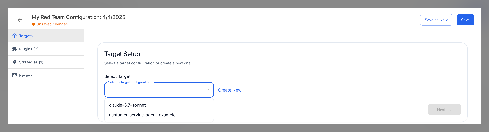
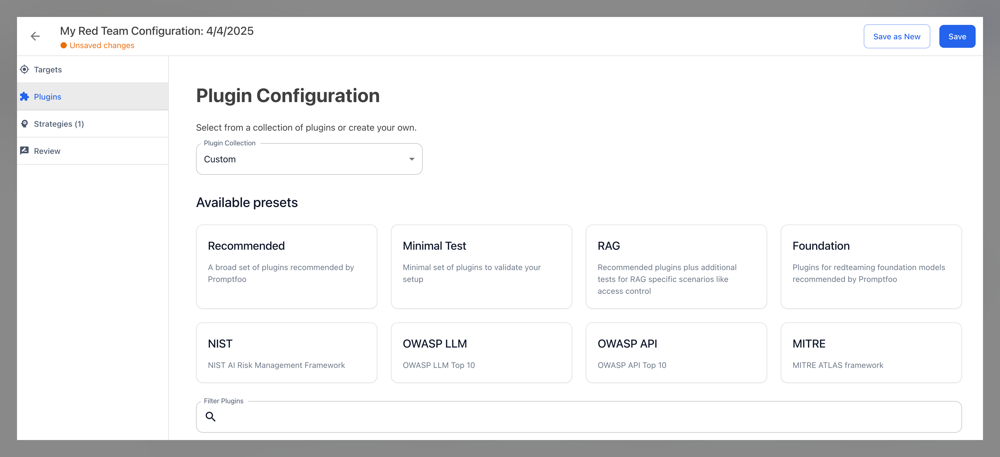
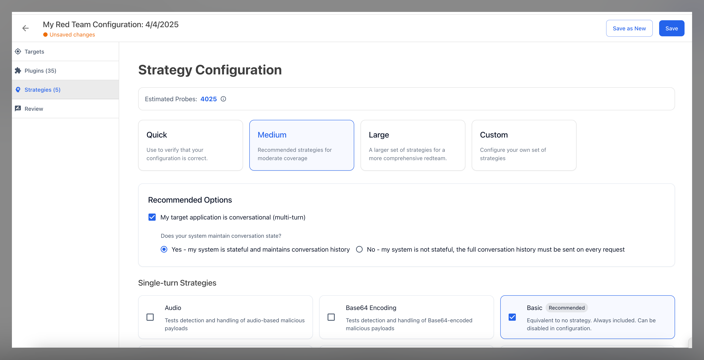
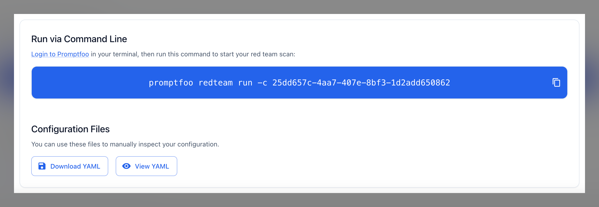
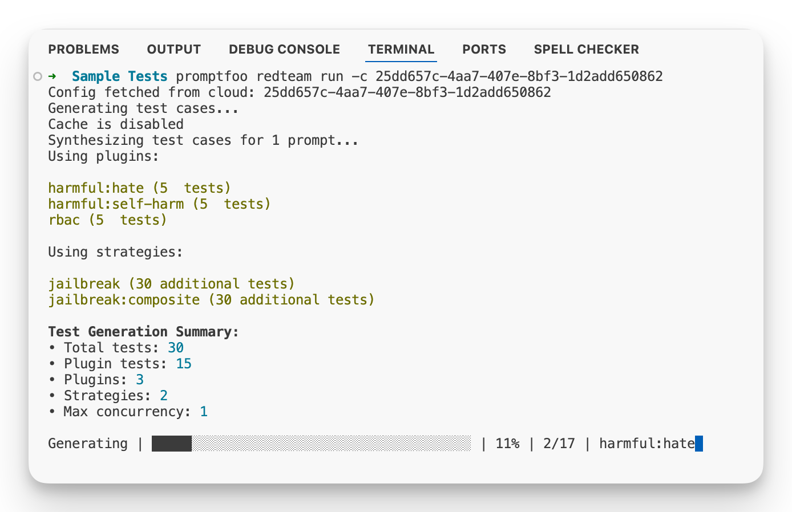

# Red Team Çalıştırma

[Promptfoo Enterprise](/docs/enterprise/), takımınız arasında paylaşılabilen hedefleri, eklenti koleksiyonlarını ve tarama yapılandırmalarını yapılandırmanıza olanak tanır.

## Promptfoo'ya Bağlanma

Promptfoo'nun çalışması için [\*.promptfoo.app](https://promptfoo.app) adresine erişim gereklidir.

Bir proxy veya VPN kullanıyorsanız, red team oluşturabilmeniz için bu alan adlarını beyaz listenize eklemeniz gerekebilir.

## Hedef Oluşturma

Hedefler, test edilen LLM varlıklarıdır. Bir web uygulaması, ajan, temel model veya herhangi bir LLM varlığı olabilirler. Bir hedef oluşturduğunuzda, bu hedefe takımınızdaki diğer kullanıcılar tarama çalıştırmak için erişebilir.

"Hedefler" sekmesine gidip "Hedef Oluştur" düğmesine tıklayarak bir hedef oluşturabilirsiniz.

"Genel Ayarlar" bölümü, test ettiğiniz hedef türünü belirlediğiniz ve hedefe bağlanmak, probları iletmek ve yanıtları ayrıştırmak için teknik ayrıntıları sağladığınız yerdir.

"Bağlam" bölümü, Promptfoo'nun düşmanca problar oluşturmasına yardımcı olacak hedef hakkında ek bilgi sağladığınız yerdir. Burada hedefin birincil amacı ve uyması gereken kurallar hakkında bağlam sağlar ve red team'in hangi tür kullanıcıyı taklit etmesi gerektiğini belirtirsiniz.

Ne kadar çok bilgi sağlarsanız, red team saldırıları ve puanlaması o kadar iyi olacaktır.

### Harici Sistemlere Erişim

Hedefinizde RAG düzenlemesi varsa veya bir ajansa, harici sistemlere bağlantı hakkında ek ayrıntılar sağlamak için "Harici Sistemlere Erişim" seçeneğini seçebilirsiniz. Hedefin harici sistemlere erişimi hakkında ek bağlam sağlamak, Promptfoo'nun daha doğru red team saldırıları ve puanlaması oluşturmasına yardımcı olacaktır.

Hedefiniz bir ajansa, "Bu uygulamaya hangi harici sistemler bağlı?" sorusunda ajanın araçlara ve fonksiyonlara erişimi hakkında ek bağlam sağlayabilirsiniz. Bu, Promptfoo'nun [araç keşfi eklentisini](/docs/red-team/plugins/tool-discovery/) çalıştırırken araçları ve fonksiyonları başarıyla numaralandırıp numaralandıramadığını belirlemesine yardımcı olacaktır.

## Eklenti Koleksiyonları Oluşturma

Takımınız arasında paylaşmak için eklenti koleksiyonları oluşturabilirsiniz. Bu eklenti koleksiyonları, özel politikalar ve promptlar oluşturma dahil olmak üzere hedeflerinize karşı test çalıştırmak için belirli ön ayarlar oluşturmanıza olanak tanır.

Bir eklenti koleksiyonu oluşturmak için "Red team" gezinme başlığı altındaki "Eklenti Koleksiyonları" sekmesine gidin ve "Eklenti Koleksiyonu Oluştur" düğmesine tıklayın.

## Taramaları Yapılandırma

Yeni bir red team taraması çalıştırmak istediğinizde, "Red team" gezinme başlığına gidin ve "Tarama Yapılandırmaları"na tıklayın. Takımınızın oluşturduğu tüm tarama yapılandırmalarının bir listesini göreceksiniz. Yeni bir tarama oluşturmak için "Yeni Tarama"ya tıklayın.

Promptfoo'nun açık kaynak sürümünden veya yerel kullanımdan zaten bir tarama yapılandırması oluşturduysanız, Promptfoo Enterprise'da kullanmak için YAML dosyasını içe aktarabilirsiniz.

Yeni bir tarama yapılandırmak için "Tarama Oluştur"a tıklayın. Ardından bir hedef seçmeniz istenecektir. Alternatif olarak, yeni bir hedef oluşturabilirsiniz.

Bir hedef seçtikten sonra, bir eklenti koleksiyonu seçmeniz istenecektir. Bir eklenti koleksiyonunuz yoksa yeni bir tane oluşturabilirsiniz.

Bir eklenti koleksiyonu seçtikten sonra, stratejileri seçmeniz istenecektir. [Promptfoo stratejileri](/docs/red-team/strategies/), saldırı başarı oranlarını en üst düzeye çıkarmak için düşmanca probların iletilme yöntemleridir.

## Tarama Çalıştırma

Bir hedef, eklenti koleksiyonu ve stratejiler seçerek bir tarama yapılandırdıktan sonra, "İnceleme" bölümüne giderek bir red team taraması oluşturabilirsiniz. Promptfoo'nun bir CLI komutu oluşturması için "Yapılandırmayı Kaydet"e tıklayın. Taramayı çalıştırmak ve sonuçları paylaşmak için CLI'ya [kimlik doğrulaması](./kimlik-dogrulama.md) yapmanız gerekecektir.

Alternatif olarak, Promptfoo YAML dosyasını indirebilir ve taramayı yerel olarak çalıştırabilirsiniz.

Komutu terminalinize girdiğinizde, Promptfoo düşmanca probları oluşturacak ve test vakalarını yerel olarak yazacaktır.

Oluşturulduktan sonra, Promptfoo test vakalarını hedefinize karşı yürütecek ve sonuçları Promptfoo Enterprise'a yükleyecektir. Terminalde oluşturulan değerlendirme bağlantısına tıklayarak veya Promptfoo Enterprise'a giderek sonuçları inceleyebilirsiniz.

## Ayrıca Bakınız

- [Bulgular ve Raporlar](./bulgular-ve-raporlar.md)
- [Kimlik Doğrulama](./kimlik-dogrulama.md)
- [Hizmet Hesapları](./hizmet-hesaplari.md)
