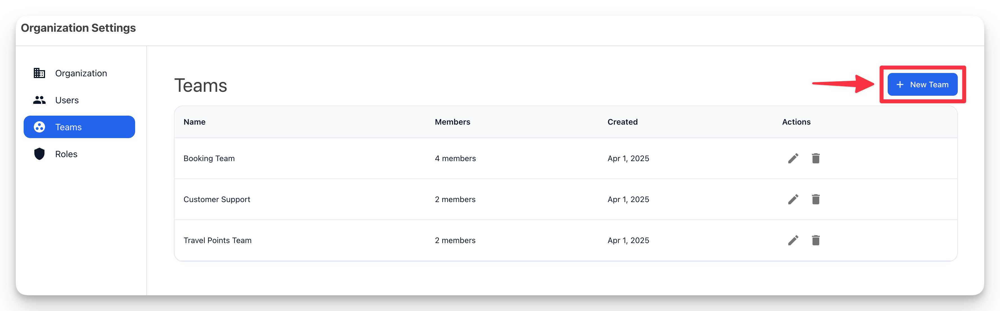
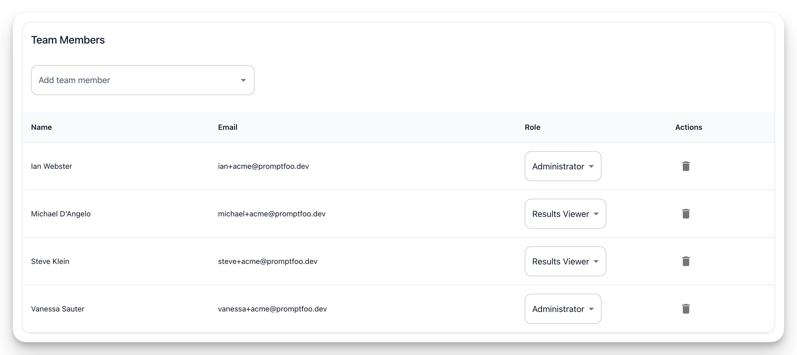
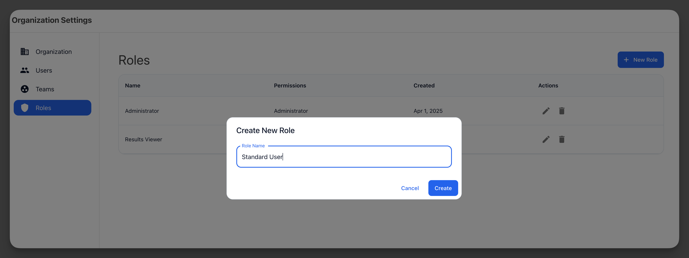

# Rolleri ve Takımları Yönetme

[Promptfoo Enterprise](/docs/enterprise/), organizasyonunuzun kaynaklarına kullanıcı erişimini yönetmenize olanak tanıyan esnek bir rol tabanlı erişim kontrolü (RBAC) sistemini destekler.

## Takım Oluşturma

Promptfoo Enterprise, bir organizasyon içinde birden fazla takımı destekler. Bir takım oluşturmak için kenar çubuğundaki "Takımlar" sekmesine gidin ve "Yeni Takım" düğmesine tıklayın.



Takımı düzenleyip "Takım üyeleri ekle" düğmesine tıklayarak bir takıma kullanıcı ekleyebilirsiniz. Bu aynı zamanda kullanıcının takımdaki rolünü belirlemenize de olanak tanır.



Ayrıca takım düzeyinde hizmet hesapları oluşturabilirsiniz, bu da Promptfoo Enterprise'a programatik erişim için API anahtarları oluşturmanıza olanak tanır. Bunlar CI/CD pipeline'ları ve otomatik testler için kullanışlıdır.

:::note
Yalnızca sistem yöneticileri hizmet hesapları oluşturabilir.
:::

## CLI Takım Bağlamı

Promptfoo CLI'yı birden fazla takımla kullanırken, işlemlerinizin hangi takım bağlamını kullandığını kontrol edebilirsiniz:

### Aktif Takımınızı Ayarlama

Giriş yaptıktan sonra, aktif takımınızı şunu kullanarak ayarlayın:

```sh
promptfoo auth teams set "Takım Adınız"
```

Sonraki tüm CLI işlemleri (değerlendirmeler, sonuç paylaşma vb.) bu takım bağlamını kullanacaktır.

### Takım Bağlamını Doğrulama

Önemli işlemleri çalıştırmadan önce aktif takımınızı doğrulayın:

```sh
promptfoo auth whoami
```

Bu, mevcut organizasyonunuzu ve takımınızı görüntüler.

### Takım İzolasyonu

- **API anahtarları organizasyon kapsamındadır**: API anahtarınız hangi organizasyona giriş yaptığınızı belirler
- **Takım seçimleri organizasyon başına izole edilir**: Birden fazla organizasyona erişiminiz varsa, her organizasyon kendi takım seçimini bağımsız olarak hatırlar
- **Kaynaklar takım kapsamındadır**: Değerlendirmeler, yapılandırmalar ve sonuçlar aktif takımınızla ilişkilendirilir

:::tip
Değerlendirme sonuçlarını paylaşmadan veya taramalar çalıştırmadan önce doğru takıma gittiklerinden emin olmak için her zaman `promptfoo auth whoami` ile takım bağlamınızı doğrulayın.
:::

## Rol Oluşturma

Promptfoo, organizasyonunuzun kaynaklarına kullanıcı erişimini yönetmek için özel roller oluşturmanıza olanak tanır. Bir rol oluşturmak için kenar çubuğundaki "Roller" sekmesine gidin ve "Yeni Rol" düğmesine tıklayın.



### İzinler

Promptfoo Enterprise aşağıdaki izinleri destekler:

- **Yönetici**: Takımdaki her şeye tam erişim
- **Yapılandırmaları Görüntüle**: Yapılandırmaları, hedefleri ve eklenti koleksiyonlarını görüntüleme
- **Tarama Çalıştır**: Taramaları çalıştırma ve sonuçları görüntüleme
- **Yapılandırmaları Yönet**: Yapılandırmaları ve eklenti koleksiyonlarını oluşturma, düzenleme ve silme
- **Hedefleri Yönet**: Hedefleri oluşturma, düzenleme ve silme
- **Sonuçları Görüntüle**: Sorunları ve değerlendirmeleri görüntüleme
- **Sonuçları Yönet**: Değerlendirmeleri ve sorunları düzenleme ve silme

## Ayrıca Bakınız

- [Kimlik Doğrulama](./kimlik-dogrulama.md)
- [Hizmet Hesapları](./hizmet-hesaplari.md)
