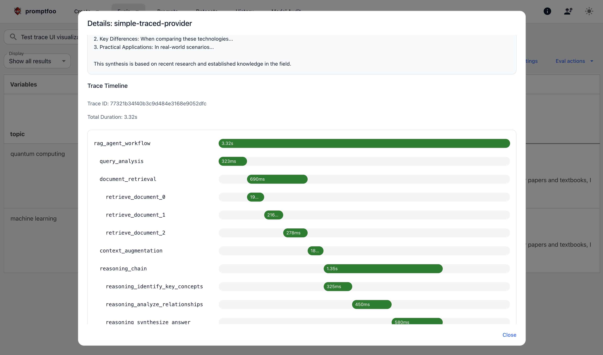

# Sürüm Notları

Promptfoo açık kaynak için tam sürüm geçmişi [GitHub](https://github.com/promptfoo/promptfoo/releases) üzerinde bulunabilir.

## Ocak 2026 Sürüm Öne Çıkanları 

Bu ay **uyarlanabilir hız sınırlama**, **yerel çıkarım için Transformers.js**, **telekomünikasyon kırmızı takım eklentileri** ve **video oluşturma sağlayıcıları** yayınladık.

### Değerlendirmeler 

#### Sağlayıcılar 

##### Yeni Sağlayıcılar

- **[Transformers.js](/docs/providers/transformers/)** - Hugging Face'in Transformers.js'ini kullanarak Node.js veya tarayıcıda modelleri yerel olarak çalıştırın
- **[Vercel AI Gateway](/docs/providers/vercel/)** - İstekleri Vercel'in AI ağ geçidi üzerinden yönlendirin
- **[Cloudflare AI Gateway](/docs/providers/cloudflare-gateway/)** - İstekleri Cloudflare'in AI ağ geçidi üzerinden yönlendirin

##### Video Oluşturma

- **[AWS Bedrock Video](/docs/providers/aws-bedrock/)** - Nova Reel ve Luma Ray 2 video oluşturma
- **[Azure AI Foundry Video](/docs/providers/azure/)** - Azure üzerinden Sora video oluşturma

##### Sağlayıcı Güncellemeleri

- **[HTTP sağlayıcı](/docs/providers/http/)** - Durum bilgili konuşmalar için yerel oturum uç noktası desteği
- **[xAI Ses](/docs/providers/xai/)** - `apiBaseUrl`, `websocketUrl` geçersiz kılma ve fonksiyon çağrısı desteği eklendi
- **[OpenCode SDK](/docs/providers/opencode-sdk/)** - Yeni özelliklerle v1.1.x'e güncellendi
- **[OpenAI Codex](/docs/providers/openai-codex-sdk/)** - Entegre izleme ve collaboration_mode desteği
- **[WatsonX](/docs/providers/watsonx/)** - Geliştirilmiş parametreler ve sohbet desteği

#### Doğrulamalar

- **word-count** - Yanıt kelime sayılarını doğrulamak için yeni doğrulama türü
- **`__count` değişkeni** - Ortalamaları hesaplamak için türetilmiş metriklerde kullanın

#### Arayüz ve Geliştirici Deneyimi

- **Sağlayıcı yapılandırma önizlemesi** - Değerlendirme sonuçlarında fareyle üzerine gelindiğinde sağlayıcı yapılandırma ayrıntılarını görüntüleyin
- **Oturum kimliği sütunu** - `metadata.sessionId` tablolarda ve dışa aktarmalarda değişken sütunu olarak gösterilir
- **Kullanıcı puanlamalı filtre** - Yalnızca manuel olarak puanlanan sonuçları göstermek için filtre
- **`promptfoo logs`** - Log dosyalarını doğrudan görüntülemek için yeni komut

#### Hız Sınırlama

- **[Uyarlanabilir hız sınırlama zamanlayıcı](/docs/configuration/rate-limits/)** - Sağlayıcı hız sınırlarına ve yanıt başlıklarına göre eşzamanlılığı otomatik olarak ayarlar

#### Yapılandırma

- **Test düzeyinde prompt filtresi** - Bireysel test durumu düzeyinde promptları filtreleyin
- **Sağlayıcı filtresi** - Test durumu düzeyinde sağlayıcıları filtreleyin
- **Test başına yapılandırılmış çıktı** - Test durumu düzeyinde yapılandırılmış çıktıları ayarlayın
- **Yollarda ortam değişkenleri** - Dosya yollarında `$VAR` sözdizimini kullanın
- **Birden fazla `--env-file` bayrağı** - Birden fazla ortam dosyası yükleyin

#### Kod Taraması

- **Fork PR desteği** - Fork'lardan gelen pull request'leri tarayın
- **Yorum tetiklemeli taramalar** - PR yorumları aracılığıyla taramaları tetikleyin

#### Model Denetimi

- **Otomatik paylaşım bayrakları** - Bulut paylaşımını kontrol etmek için `--share` ve `--no-share` kullanın

### Kırmızı Takım

#### Yeni Eklentiler

- **[Telekomünikasyon](/docs/red-team/plugins/telecom/)** - Telekomünikasyon yapay zeka sistemleri için sektöre özel kırmızı takım eklentileri
- **[RAG Kaynak Atıfı](/docs/red-team/plugins/rag-source-attribution/)** - RAG sistemlerinin yanıtlarında kaynakları düzgün şekilde atfedip atfetmediğini test edin

#### Çoklu Girdi Testi

Kırmızı takım taramaları artık [birden fazla girdi değişkenini](/docs/red-team/configuration/) destekleyerek karmaşık girdi yapılarına sahip sistemleri test etmenize olanak tanır.

#### Strateji Yapılandırması

- **numTests yapılandırması** - Strateji başına oluşturulan test durumu sayısını sınırlayın
- **`-d/--description` bayrağı** - `redteam generate` komutlarına açıklamalar ekleyin
- **Erken tarama durdurma** - Eklentiler test durumları oluşturamadığında taramalar erken durur

### Kurumsal

#### Performans

- **Otomatik yeniden denemeler** - Geçici 5xx hataları otomatik olarak yeniden denenir
- **Python eşzamanlılığı** - `-j` bayrağı artık Python işçi havuzlarına yayılır

---

## Aralık 2025 Sürüm Öne Çıkanları 

Bu ay **video oluşturma sağlayıcıları**, **OWASP Ajanlı Yapay Zeka İlk 10**, **xAI Ses Ajanı** ve **çok modlu saldırı stratejileri** yayınladık.

### Değerlendirmeler

#### Sağlayıcılar 

##### Video Oluşturma Sağlayıcıları

- **[OpenAI Sora](/docs/providers/openai/)** - OpenAI'ın Sora modeliyle videolar oluşturun
- **[Google Veo](/docs/providers/google/)** - Google'ın Veo modeliyle videolar oluşturun

##### Yeni Sağlayıcılar

- **[xAI Ses Ajanı](/docs/providers/xai/)** - Sesli etkileşimler için ses ajanı API'si
- **[ElevenLabs](/docs/providers/elevenlabs/)** - Metinden konuşmaya ve ses sentezi
- **[OpenCode SDK](/docs/providers/opencode-sdk/)** - OpenCode model sağlayıcısı

##### Yeni Model Desteği

- **[GPT-5.2](/docs/providers/openai/)** - En son GPT-5 serisi model
- **[Amazon Nova 2](/docs/providers/aws-bedrock/)** - Muhakeme yeteneklerine sahip Nova 2
- **[Gemini 3 Flash Önizleme](/docs/providers/google/)** - Vertex AI ekspres modu ile Flash Önizleme
- **[Llama 3.2 Vision](/docs/providers/aws-bedrock/)** - Bedrock InvokeModel API aracılığıyla görüntü desteği
- **[GPT Image 1.5](/docs/providers/openai/)** - Güncellenmiş görüntü oluşturma modeli
- **gpt-image-1-mini** - Daha küçük görüntü oluşturma modeli

##### Sağlayıcı Güncellemeleri

- **[Tarayıcı sağlayıcı](/docs/providers/browser/)** - Çok turlu oturum kalıcılığı
- **[Vertex AI](/docs/providers/vertex/)** - Model Armor için akış seçeneği
- **[Gemini](/docs/providers/google/)** - Yerel görüntü oluşturma desteği
- **[Claude Agent SDK](/docs/providers/claude-agent-sdk/)** - Beta ve dontAsk desteğiyle v0.1.60'a güncellendi
- **[OpenAI Codex SDK](/docs/providers/openai-codex-sdk/)** - v0.65.0'a güncellendi

#### Arayüz ve Geliştirici Deneyimi

- **Yeniden tasarlanan raporlar** - Risk kategorilerinin gelişmiş görselleştirmesi
- **Değerlendirme süresi** - Web arayüzünde toplam değerlendirme süresini görüntüleme
- **Tam derecelendirme prompt gösterimi** - Arayüzde tam derecelendirme promptlarını görüntüleyin
- **Joker karakter prompt filtreleri** - Promptları filtrelerken joker karakterler kullanın

#### İzleme

- **[OpenTelemetry entegrasyonu](/docs/tracing/)** - GenAI semantik kurallarıyla yerel OTLP izleme
- **Protobuf desteği** - Protobuf formatı aracılığıyla OTLP izleme alımı

#### Yapılandırma

- **Yapılandırılabilir temel yol** - Sunucu için özel temel yollar belirleyin
- **`--extension` CLI bayrağı** - Komut satırı üzerinden uzantıları yükleyin
- **afterAll kanca geliştirmesi** - Geliştirilmiş uzantı kanca yetenekleri
- **API'de paylaşılabilir URL'ler** - Node.js `evaluate()` API'sinden paylaşılabilir URL'ler oluşturun

#### Kimlik Doğrulama

- **Etkileşimli takım seçimi** - Giriş akışında takım seçimi
- **[MCP OAuth](/docs/providers/mcp/)** - Proaktif token yenileme ile OAuth kimlik doğrulaması

### Kırmızı Takım

#### OWASP Ajanlı Yapay Zeka

- **[Ajanlı Uygulamalar için OWASP İlk 10](/docs/red-team/owasp-agentic-ai/)** - Yapay zeka ajanları için eksiksiz T1-T15 tehdit eşlemesi
- **[OWASP API Güvenliği İlk 10](/docs/red-team/owasp-api-top-10/)** - API güvenlik testi için örnek yapılandırma

#### Çok Modlu Saldırılar

- **[Çok modlu katman stratejisi](/docs/red-team/strategies/layer/)** - Katman stratejilerinde ses ve görüntü saldırılarını zincirleyin

#### Strateji İyileştirmeleri

- **Stratejiler için eklenti seçimi** - Strateji test durumu oluşturma için hangi eklentinin kullanılacağını değiştirin
- **SSRF için kademeli ciddiyet** - Derecelendirme artık kademeli ciddiyet seviyelerini kullanıyor
- **HTTP kimlik doğrulama seçenekleri** - HTTP hedefleri için kimlik doğrulama yapılandırın
- **Tarayıcı iş kalıcılığı** - Tarayıcı tabanlı değerlendirmeler için işleri kalıcı hale getirin
- **Hydra için izleme** - Hydra ve IterativeMeta'da OpenTelemetry izleme desteği

#### Diğer İyileştirmeler

- **Uygulama durumları için bağlamlar** - Bağlam yapılandırmasıyla farklı uygulama durumlarını test edin
- **Yeniden deneme stratejisi** - Başarısız test durumlarını otomatik olarak yeniden deneyin
- **Hedef doğrulama iyileştirmeleri** - Hedefleri doğrularken daha iyi çıktı

### Kurumsal 

#### Doğrulamalar

- **Araç çağrısı F1 puanı** - Araç çağrısı doğruluğunu F1 metrikleriyle değerlendirin

#### Bedrock

- **Yapılandırılabilir numberOfResults** - Bedrock Bilgi Tabanı sorguları için sonuç sayısını ayarlayın

---

## Kasım 2025 Sürüm Öne Çıkanları 

Bu ay **Hydra çok turlu stratejisi**, **kod taraması**, **Claude Opus 4.5** ve **VS Code uzantısı** yayınladık.

### Değerlendirmeler

#### Sağlayıcılar

##### Yeni Sağlayıcılar

- **[OpenAI ChatKit](/docs/providers/openai-chatkit/)** - Konuşma yapay zekası için ChatKit sağlayıcısı
- **[OpenAI Codex SDK](/docs/providers/openai-codex-sdk/)** - Kod oluşturma için Codex SDK
- **[AWS Bedrock Converse API](/docs/providers/aws-bedrock/)** - Çok turlu konuşmalar için Converse API

##### Yeni Model Desteği

- **[Claude Opus 4.5](/docs/providers/anthropic/)** - Anthropic, Google Vertex AI ve AWS Bedrock genelinde destek
- **[GPT-5.1](/docs/providers/openai/)** - En son GPT-5 serisi güncellemesi
- **[Gemini 3 Pro](/docs/providers/google/)** - Düşünme yapılandırmalı Pro model
- **[Groq muhakeme modelleri](/docs/providers/groq/)** - Responses API ve yerleşik araçlarla muhakeme modelleri
- **[xAI Responses API](/docs/providers/xai/)** - Agent Tools desteğiyle Responses API

##### Sağlayıcı Güncellemeleri

- **[Anthropic](/docs/providers/anthropic/)** - Yapılandırılmış çıktı desteği
- **[Claude Agent SDK](/docs/providers/claude-agent-sdk/)** - Eklenti desteği ve ek seçenekler
- **[Vertex AI](/docs/providers/vertex/)** - Google Cloud Model Armor desteği
- **[Azure](/docs/providers/azure/)** - Kapsamlı model desteği, ayrıntı düzeyi ve isReasoningModel yapılandırması
- **[Simüle Edilmiş Kullanıcı](/docs/providers/simulated-user/)** - Değişken şablonlama ile initialMessages desteği

#### Doğrulamalar

- **Web arama doğrulaması** - Web arama sonuçları üzerinde doğrulama yapın
- **Nokta çarpımı ve öklid uzaklığı** - Gömülmeler için yeni benzerlik metrikleri

#### Arayüz ve Geliştirici Deneyimi

- **Değerlendirme sonuçları filtre kalıcı bağlantıları** - URL'lerle filtrelenmiş görünümleri paylaşın
- **Meta veri değeri otomatik tamamlama** - Meta veri filtre değerleri için otomatik tamamlama
- **İşlenmiş doğrulama değerleri** - Değerlendirme sekmesinde işlenmiş doğrulama değerlerini görüntüleyin
- **Değerlendirme kopyalama işlevi** - Değerlendirmeleri yeni yapılandırmalara kopyalayın
- **Geliştirilmiş silme deneyimi** - Onay iletişim kutusu ve akıllı gezinme
- **Toplam ve filtrelenmiş metrikler** - Hem toplam hem de filtrelenmiş sayıları görüntüleyin

#### Yapılandırma

- **XLSX/XLS desteği** - Excel dosyalarından test durumları yükleyin
- **Çalıştırılabilir prompt betikleri** - Betikleri prompt olarak çalıştırın
- **Yapılandırmada uyumluluk çerçeveleri** - Belirli uyumluluk çerçevelerini ayarlayın
- **Dosyalardan araç tanımları** - Python/JavaScript dosyalarından araç tanımlarını yükleyin
- **Yerel yapılandırma geçersiz kılma** - Bulut sağlayıcı yapılandırmalarını yerel olarak geçersiz kılın

#### Entegrasyonlar

- **Microsoft SharePoint** - SharePoint'ten veri setleri yükleyin
- **Bulut izleme paylaşımı** - İzleme verilerini Promptfoo Cloud'a paylaşın

#### Model Denetimi

- **Revizyon takibi** - Model taramaları için HuggingFace Git SHA'larını takip edin
- **Tekilleştirme** - İçerik hash'ine göre daha önce taranmış modelleri atlayın

### Kırmızı Takım 

#### Hydra Stratejisi

**[Hydra](/docs/red-team/strategies/hydra/)**, hedef yanıtlarına göre dinamik olarak uyarlanan, güvenlik açıklarını araştırmak için konuşma tekniklerini kullanan yeni bir gelişmiş çok turlu kırmızı takım stratejisidir.

#### Kod Taraması

**[Kod taraması](/docs/code-scanning/)**, üretime ulaşmadan önce potansiyel yapay zeka güvenlik sorunları için kod tabanınızı analiz eder.

#### VS Code Uzantısı

Güvenlik taramalarını doğrudan düzenleyicinizden çalıştırmak için **VS Code kırmızı takım uzantısını** yükleyin.

#### Yeni Eklentiler

- **[FERPA](/docs/red-team/plugins/ferpa/)** - Eğitim gizliliği uyumluluk testi
- **[E-ticaret](/docs/red-team/plugins/ecommerce/)** - E-ticarete özel güvenlik açığı testi

#### Eklenti İyileştirmeleri

- **Özel politika oluşturma** - Doğal dil açıklamalarından politikalar oluşturun
- **Alana özel risk paketleri** - Farklı sektörler için düzenlenmiş dikey paketler
- **Ayrıntılı zararlı alt kategoriler** - Zararlı içerik eklentileri için ayrıntılı metrikler gösterin
- **VLGuard güncellemesi** - Artık MIT lisanslı veri seti kullanıyor

#### Derecelendirme İyileştirmeleri

- **Derecelendirme rehberlik yapılandırması** - Yapılandırma aracılığıyla ek derecelendirme kuralları ekleyin
- **Derecelendirme rehberlik arayüzü** - Arayüzde eklentiye özel derecelendirme kurallarını yapılandırın
- **Zaman damgası bağlamı** - Tüm derecelendirme kriterleri artık zaman damgası bağlamı içeriyor

#### Strateji İyileştirmeleri

- **Katman stratejisi arayüzü** - Katman stratejileri için kapsamlı yapılandırma arayüzü
- **Strateji test oluşturma** - Arayüzde stratejiler için test durumları oluşturun
- **OWASP Ajanlı İlk 10 ön ayarı** - Uygun eklentiler ve stratejilerle ön ayar
- **İzleme bağlamı** - Stratejiler artık hata ayıklama için izleme bağlamı kullanıyor

### Kurumsal 

#### Sağlayıcı Yönetimi

- **Sunucu tarafı sağlayıcı listesi** - Sunucudan kullanılabilir sağlayıcıları özelleştirin

#### Ses

- **OpenAI ses transkripsiyonu** - Analiz için sesi yazıya dökün

---

## Ekim 2025 Sürüm Öne Çıkanları 

Bu ay **jailbreak:meta kırmızı takım stratejisi**, **iyileştirme raporları** ve **HTTP hedefleri için Postman/cURL içe aktarma** yayınladık.

### Değerlendirmeler 

#### Sağlayıcılar

##### Yeni Sağlayıcılar

- **[OpenAI Agents SDK](/docs/providers/openai/)** - Ajanlar, araçlar, devretmeler ve OTLP izleme
- **[Claude Agent SDK](/docs/providers/anthropic/)** - Anthropic ajan çerçevesi
- **[Azure AI Foundry Agents](/docs/providers/azure/#azure-ai-foundry-agents)** - Azure AI ajan çerçevesi
- **[Ruby](/docs/providers/ruby/)** - Ruby betiklerini sağlayıcı olarak çalıştırın
- **[Snowflake Cortex](/docs/providers/snowflake/)** - Snowflake LLM sağlayıcısı
- **[Slack](/docs/providers/slack/)** - Slack botlarını test edin

##### Yeni Model Desteği

- **[Claude Haiku 4.5](/docs/providers/anthropic/)**

##### Sağlayıcı Güncellemeleri

- **[Python sağlayıcı](/docs/providers/python/)** - 10-100x performans iyileştirmesi için kalıcı işçi havuzları
- **[WebSocket sağlayıcı](/docs/providers/websocket/)** - Birden fazla yanıt akışı
- **[Ollama](/docs/providers/ollama/)** - Fonksiyon çağrısı ve araç desteği

#### Arayüz ve Geliştirici Deneyimi

- **Sohbet Oyun Alanı yeniden tasarımı** - Yeni düzen ve yanıt görselleştirmesi
- **Operatörlü metrik filtreleme** - `eq`, `neq`, `gt`, `gte`, `lt`, `lte` ve `is_defined` operatörleriyle değerlendirme sonuçlarını filtreleyin
- **Klavye gezinmesi** - Ok tuşları ve Enter ile değerlendirme sonuçları tablosunda gezinin
- **Önbelleğe alınmış yanıt gecikmesi** - Yanıtlar önbelleğe alındığında gecikme ölçümleri korunur
- **Dosya tabanlı günlükleme** - Günlükler CLI akışı yerine dosyalara yazılır

#### Dışa Aktarma ve Entegrasyon

- **SARIF dışa aktarma** - Güvenlik açığı raporlarını SARIF formatında dışa aktarın
- **CSV dışa aktarmaları** - CSV dışa aktarmalarına Strateji Kimliği, Eklenti Kimliği ve Oturum Kimlikleri eklendi

#### Yapılandırma

- **[MCP sunucu yapılandırması](/docs/providers/mcp/)** - Model Bağlam Protokolü sunucu kurulumu

#### Model Denetimi

- **Revizyon takibi ve tekilleştirme** - HuggingFace Git SHA'larını ve içerik hash'lerini takip edin
- **Toplu varlık kontrolleri** - Birden fazla modelin daha önce taranıp taranmadığını kontrol edin

### Kırmızı Takım 

#### İyileştirme Raporları

[İyileştirme raporları](/docs/red-team/) şunları içerir:

- **Yönetici özeti** - Tarama bulgularına genel bakış
- **Önceliklendirilmiş eylem öğeleri** - Ciddiyet ve etkiye göre sıralanmış öneriler
- **Sistem prompt önerileri** - Önerilen prompt iyileştirmeleri
- **Koruma bariyeri önerileri** - Önerilen koruma bariyerleri

Herhangi bir güvenlik açığı raporundan "İyileştirme Raporunu Görüntüle"ye tıklayarak erişebilirsiniz.

#### Kırmızı Takım Stratejileri

##### jailbreak:meta

**[jailbreak:meta](/docs/red-team/strategies/meta/)** saldırılar oluşturmak için birden fazla yapay zeka ajanı kullanır. Bu tek atışlık strateji, bazı çok turlu saldırılardan %50'ye kadar daha etkilidir.

#### Tarama Şablonu Geliştirmeleri

- **Sonda ve çalışma süresi tahminleri** - Tarama şablonlarında tahmini sonda sayısını ve çalışma süresini görüntüleyin
- **Örnek saldırı önizlemeleri** - Eklentileri seçerken oluşturulan test durumlarını önizleyin

#### HTTP Hedef Yapılandırması

- **Postman/cURL içe aktarma** - curl komutlarından veya Postman istek/yanıt dosyalarından hedef bağlantı ayrıntılarını otomatik doldurma
- **Bağlantı testi** - Kurulum arayüzünde HTTP bağlantılarını ve dönüşümleri test edin
- **İstek dönüşümleri** - İstek dönüşümleri yanıt dönüşümleriyle eşit seviyeye geldi

#### Derecelendirme Rehberliği

Eklentiye özel derecelendirme kuralları:

- **Eklenti düzeyinde özelleştirme** - Bireysel eklentiler için derecelendirme rehberliği ekleyin
- **Özel niyet desteği** - Özel niyet eklentileri için derecelendirme rehberliği
- **Atomik kayıtlar** - Rehberlik ve örnekler birlikte kaydedilir

#### Yeni Eklentiler

- **[Kelime Oyunu](/docs/red-team/plugins/wordplay/)** - Sistemlerin bilmeceler ve kafiye oyunları gibi kelime oyunları aracılığıyla küfür üretmeye kandırılıp kandırılamayacağını test eder
- **[COPPA](/docs/red-team/plugins/coppa/)** - Yapay zeka sistemlerinin ebeveyn izni veya yaş doğrulaması olmadan çocuklardan kişisel bilgi toplayıp toplamadığını test eder
- **[Veri koruma ön ayarı](/docs/red-team/gdpr/)** - Gizlilik ve kişisel veri işleme testleri

#### Diğer Stratejiler

- **[Yetkili İşaretleme Enjeksiyonu](/docs/red-team/strategies/authoritative-markup-injection/)** - İşaretlemeye gömülü kötü niyetli talimatlara karşı güvenlik açığını test eder

---

## Eylül 2025 Sürüm Öne Çıkanları 

Bu ay **yeniden kullanılabilir özel politikalar**, **risk puanlama**, **8 yeni yapay zeka sağlayıcısı** ve güvenlik ekipleri için **kapsamlı kurumsal özellikler** yayınladık.

### Değerlendirmeler 

#### Sağlayıcılar 

##### Yeni Model Desteği

- **[Claude 4.5 Sonnet](/docs/providers/anthropic/)** - Anthropic'in en son modeli
- **[Claude web araçları](/docs/providers/anthropic/)** - `web_fetch_20250910` ve `web_search_20250305` araç desteği
- **[GPT-5](/docs/providers/openai/)** - GPT-5, GPT-5 Codex ve GPT-5 Mini
- **[OpenAI Realtime API](/docs/providers/openai/)** - GPT Realtime modelleri için tam ses giriş/çıkış desteği
- **[Gemini 2.5 Flash](/docs/providers/google/)** - Flash ve Flash-Lite model desteği

##### Yeni Sağlayıcılar

- **[Nscale](/docs/providers/nscale/)** - Görüntü oluşturma sağlayıcısı
- **[CometAPI](/docs/providers/cometapi/)** - Ortam değişkeni yapılandırmasıyla 7 model
- **[Envoy AI Gateway](/docs/providers/envoy/)** - İstekleri Envoy ağ geçidi üzerinden yönlendirin
- **[Meta Llama API](/docs/providers/)** - Çok modlu Llama 4 dahil tüm 7 Meta Llama modeli

##### Sağlayıcı Güncellemeleri

- **[AWS Bedrock](/docs/providers/aws-bedrock/)** - Qwen modelleri, OpenAI GPT modelleri, API anahtarı kimlik doğrulaması
- **[AWS Bedrock Agents](/docs/providers/bedrock-agents/)** - Agent Runtime desteği (AgentCore'dan yeniden adlandırıldı)
- **[AWS Bedrock çıkarım profilleri](/docs/providers/aws-bedrock/#application-inference-profiles)** - Uygulama düzeyinde çıkarım profili yapılandırması
- **[HTTP sağlayıcı](/docs/providers/http/)** - Web arayüzü aracılığıyla TLS sertifika yapılandırması
- **[WebSocket sağlayıcı](/docs/providers/websocket/)** - OpenAI Realtime için özel uç nokta URL'leri
- **[Ollama](/docs/providers/ollama/)** - Düşünme parametresi yapılandırması
- **Azure Responses** - `azure:responses` sağlayıcı takma adı

#### Değerlendirmeleri Duraklatma/Devam Ettirme

Uzun süren değerlendirmeleri duraklatmak için `Ctrl+C` ve daha sonra devam etmek için `promptfoo eval --resume` kullanın.

#### Arayüz ve Geliştirici Deneyimi

- **Klavye gezinmesi** - Klavye kısayollarıyla sonuç tablosunda gezinin
- **Toplu silme** - Birden fazla değerlendirme sonucunu aynı anda silin
- **Şifresiz saldırı gösterimi** - Hem kodlanmış hem de çözülmüş saldırı formlarını gösterin
- **Yalnızca geçenler filtresi** - Yalnızca geçen sonuçları göstermek için filtre
- **Ciddiyet filtreleme** - Ciddiyet seviyesine göre filtreleme
- **Meta veri varlık operatörü** - Meta veri alanı varlığına göre filtreleme
- **Vurgulama filtreleme** - Vurgulanan içeriğe göre sonuçları filtreleyin
- **Kalıcı başlıklar** - Kaydırırken rapor sayfası başlıkları görünür kalır
- **Takım değiştirme** - Komut satırından takım değiştirin

#### Dışa Aktarma ve Entegrasyon

- **Geliştirilmiş CSV dışa aktarmaları** - Gecikme, derecelendirici nedeni ve derecelendirici yorumu içerir
- **Günlük dışa aktarma** - `promptfoo export logs` hata ayıklama için tar.gz oluşturur
- **Varsayılan bulut paylaşımı** - Promptfoo Cloud'a bağlıyken paylaşımı otomatik etkinleştir
- **CI ilerleme raporlama** - Uzun süren değerlendirmeler için metin tabanlı kilometre taşı raporlama

#### Yapılandırma

- **Bağlam dizileri** - Bağlamı dizi olarak iletin ([örnek](/docs/configuration/expected-outputs/model-graded/context-relevance/#array-context))
- **MCP ön ayarı** - Önceden yapılandırılmış Model Bağlam Protokolü eklenti seti

### Kırmızı Takım 

#### Yeniden Kullanılabilir Özel Politikalar

[Özel politikalar](/docs/red-team/plugins/policy/) artık bir kütüphaneye kaydedilip kırmızı takım değerlendirmelerinde yeniden kullanılabilir:

- **Politika kütüphaneleri** - Merkezi güvenlik politikası depoları oluşturun
- **CSV yükleme** - CSV aracılığıyla politikaları toplu olarak içe aktarın
- **Ciddiyet seviyeleri** - Filtreleme ve önceliklendirme için ciddiyet (düşük/orta/yüksek/kritik) atayın
- **Test oluşturma** - Politika tanımlarından örnek test durumları oluşturun

Kırmızı takım yapılandırmanızda politikalara referans verin:

```yaml
redteam:
  plugins:
    - id: policy
      config:
        policy: 'internal-customer-data-protection'
```

#### Risk Puanlama

Kırmızı takım raporları artık ciddiyet, olasılık ve etkiye dayalı [nicel risk puanları](/docs/red-team/) içerir:

- **Genel risk puanı** (0-10) sistem güvenlik duruşu için
- **Kategoriye göre risk** - Farklı güvenlik açığı türleri için puanlar
- **Risk eğilimleri** - Zaman içindeki iyileşmeyi takip edin
- **Görsel ısı haritaları** - Yüksek riskli alanları belirleyin

İyileştirmeyi önceliklendirmek ve CI/CD dağıtım kapıları ayarlamak için risk puanlarını kullanın.

#### Yeni Eklentiler

- **[VLGuard](/docs/red-team/plugins/vlguard/)** - Çok modlu görüntü-dil modeli güvenlik testi
- **[Özel Token Enjeksiyonu](/docs/red-team/plugins/special-token-injection/)** - ChatML etiketi güvenlik açığı testi (`<|im_start|>`, `<|im_end|>`)
- **Finans eklentileri** - [Gizli Açıklama](/docs/red-team/plugins/financial/), [Karşıolgusal](/docs/red-team/plugins/financial/), [Karalama](/docs/red-team/plugins/financial/), [Tarafsızlık](/docs/red-team/plugins/financial/), [Suistimal](/docs/red-team/plugins/financial/)

#### Stratejiler ve Uyumluluk

- **[Katman stratejisi](/docs/red-team/strategies/#layered-strategies)** - Tek bir taramada birden fazla stratejiyi zincirleyin
- **Eşik yapılandırması** - Testler için minimum geçme puanları belirleyin
- **[ISO 42001 uyumluluğu](/docs/red-team/iso-42001/)** - Yapay zeka yönetişimi için çerçeve uyumluluk eşlemeleri

### Kurumsal 

#### Takım Yönetimi

- **Esnek lisanslama** - Yalnızca çalıştırdığınız kırmızı takım testleri için ödeme yapın
- **Lisans takibi** - Kullanım izleme ve optimizasyon bilgileri
- **IDP eşlemesi** - SSO için kimlik sağlayıcı takım ve rol eşlemesi
- **Oturum yapılandırması** - Zaman aşımı ve etkinlik dışı kalma ayarları

#### Denetim ve Uyumluluk

- **Denetim günlüğü arayüzü** - Webhook'lar, takımlar, sağlayıcılar ve kullanıcı yönetimi için kapsamlı denetim izleri

---

## Ağustos 2025 Sürüm Öne Çıkanları 

Bu ay **yeni modeller**, **model denetimi bulut paylaşımı** ve **performans iyileştirmeleri** için destek ekledik.

### Değerlendirmeler 

#### Sağlayıcılar 

##### Yeni Model Desteği

- **[GPT-5](/docs/providers/openai/)** - Gelişmiş muhakeme yeteneklerine sahip OpenAI'ın GPT-5 modeli için destek eklendi
- **[Claude Opus 4.1](/docs/providers/anthropic/)** - Anthropic'in en son Claude modeli için destek
- **[xAI Grok Code Fast](/docs/providers/xai/)** - Kodlama görevleri için xAI'ın Grok Code Fast modeli eklendi

##### Sağlayıcı Güncellemeleri

- **[Geliştirilmiş Vertex AI](/docs/providers/vertex/)** - İyileştirilmiş kimlik bilgisi yönetimi ve kimlik doğrulama
- **[Google AI Studio](/docs/providers/google/)** - Google AI Studio modelleri için varsayılan sağlayıcı yapılandırmaları eklendi

#### Model Denetimi Bulut Paylaşımı

Model denetim sonuçları artık takım iş birliği için buluta paylaşılabilir:

- **Kalıcı denetim geçmişi** - Güvenlik taramalarını zaman içinde takip edin
- **Takım paylaşımı** - Denetim sonuçlarını takımlar arasında paylaşın
- **Merkezi depolama** - Denetim raporlarını bulutta saklayın
- **Yol yönetimi** - Son tarama yollarını geçmişten kaldırın

#### Geliştirilmiş Kimlik Doğrulama

Gelişmiş kimlik doğrulama yöntemleri için destek eklendi:

- **Sertifika depolama** - mTLS kimlik doğrulaması için istemci sertifikalarını saklayın
- **İmza kimlik doğrulaması** - Yüklenen imza tabanlı kimlik doğrulama desteği
- **Kimlik bilgisi temizleme** - Hata ayıklama günlüklerinde kimlik bilgisi ifşasını önleyin

#### Yapay Zeka Destekli HTTP Yapılandırması

Yapılandırma süresini ve hatalarını azaltmak için HTTP sağlayıcı kurulumu için otomatik doldurma yetenekleri eklendi.

#### Performans İyileştirmeleri

- **HuggingFace veri seti getirme** - Büyük veri setleri için geliştirilmiş hız ve güvenilirlik
- **Hata işleme** - Daha iyi tanılama mesajları ve yeniden deneme önerileri
- **Arayüz iyileştirmeleri** - Sadeleştirilmiş arayüzler ve ilerleme göstergeleri

### Kırmızı Takım 

#### Tıbbi Endikasyon Dışı Kullanım Eklentisi

Hastaları tehlikeye atabilecek uygunsuz ilaç önerilerini belirlemek için **[Tıbbi Endikasyon Dışı Kullanım Tespiti](/docs/red-team/plugins/medical/)** eklentisi eklendi.

#### Doğrulanamayan İddialar Eklentisi

Yapay zeka sistemlerinin uydurulmuş ancak inandırıcı görünen iddialar üretmeye yatkınlığını test etmek için **[Doğrulanamayan İddialar Tespiti](/docs/red-team/plugins/)** eklentisi eklendi.

#### MCP Ajan Testi

Model Bağlam Protokolü kullanan yapay zeka sistemlerinin nasıl test edileceğini gösteren, araç çağrısı sonuçlarıyla kırmızı takım testi için **[MCP Ajan örneği](/docs/red-team/mcp-security-testing/)** eklendi.

---

## Temmuz 2025 Sürüm Öne Çıkanları 

Bu ay **sağlayıcı desteğini** genişletmeye, **değerlendirme yeteneklerini** geliştirmeye ve daha güvenilir ve güvenli yapay zeka uygulamaları oluşturmanıza yardımcı olmak için **kurumsal özellikleri** güçlendirmeye odaklandık.

### Değerlendirmeler

#### Yeni Modeller / Sağlayıcılar 

##### Genişletilmiş Sağlayıcı Desteği

- **[Docker Model Runner](/docs/providers/docker/)** - Daha iyi güvenlik ve tekrarlanabilirlik için modelleri izole Docker konteynerlerinde çalıştırın
- **[MCP (Model Bağlam Protokolü)](/docs/providers/mcp/)** - Gelişmiş yapay zeka yetenekleri için MCP sunucularına bağlanın
- **[Google Imagen](/docs/providers/google/#image-generation-models)** - Çok modlu test senaryoları için görüntüler oluşturun
- **[AIMLAPI](/docs/providers/aimlapi/)** - Birleşik bir arayüz üzerinden çeşitli yapay zeka modellerine erişin

##### Yeni Model Desteği

- **[Grok-4](/docs/providers/xai/)** - xAI'dan gelişmiş muhakeme yetenekleri
- **OpenAI Derin Araştırma Modelleri** - Karmaşık problem çözme için [o3-deep-research ve o4-mini-deep-research](/docs/providers/openai/#deep-research-models-responses-api-only)
- **Geliştirilmiş Azure Sağlayıcı** - Daha iyi kontrol için sistem prompt desteği eklendi

##### Geliştirilmiş Yetenekler

- **[LiteLLM Gömülmeleri](/docs/providers/litellm/#embedding-configuration)** - Benzerlik testi ve anlamsal arama
- **[Google Vision](/docs/providers/google/#chat-and-multimodal-models)** - Çok modlu değerlendirmeler için görüntü anlama
- **HTTP Sağlayıcı Geliştirmeleri** - [JKS](/docs/providers/http/#using-jks-java-keystore-certificates) ve [PFX](/docs/providers/http/#using-pfxpkcs12-certificates) istemci sertifikaları için destek eklendi.
- **[Tarayıcı Sağlayıcı](/docs/providers/browser/)** - OAuth kimlik doğrulamalı uygulamaları test etmek için Chrome DevTools Protokolü (CDP) aracılığıyla mevcut Chrome tarayıcı oturumlarına bağlanın

#### Doğrulama İyileştirmeleri 

- **Bağlam Dönüşümleri**: Doğrulamalarda kullanmak üzere sağlayıcı yanıtlarından ek veriler çıkarın: [bağlam tabanlı doğrulamalar](/docs/configuration/expected-outputs/model-graded/#dynamically-via-context-transform). Bunlar özellikle RAG sistemlerini değerlendirmek için kullanışlıdır.
- **Bitiş Nedeni Doğrulama**: Yapay zeka model yanıtlarının nasıl sonlandırıldığını doğrulamak için doğrulamalarda [finish-reason](/docs/configuration/expected-outputs/deterministic/#finish-reason) seçeneğini kullanın. Bu, modelin doğal olarak tamamlanıp tamamlanmadığını, token sınırlarına ulaşıp ulaşmadığını, içerik filtrelerini tetikleyip tetiklemediğini veya beklendiği gibi araç çağrıları yapıp yapmadığını kontrol etmek için kullanışlıdır.
- **İzleme Doğrulamaları**: İzleme ve telemetri verilerinizi doğrulamalarda kullanın: [trace-span-count](/docs/configuration/expected-outputs/deterministic/#trace-span-count), [trace-span-duration](/docs/configuration/expected-outputs/deterministic/#trace-span-duration) ve [trace-error-spans](/docs/configuration/expected-outputs/deterministic/#trace-error-spans)

#### Diğer Özellikler 

- **Harici Test Yapılandırması** - defaultTest artık daha kolay yönetim için harici dosyalardan test durumları yükleyebilir

#### Geliştirici Deneyimi İyileştirmeleri 

- **Python Hata Ayıklama** - Daha kolay hata ayıklama için çalıştırılan üçüncü taraf Python betiklerinde `import pdb; pdb.set_trace()` kullanın
- **Geliştirilmiş Arama** - Arama operatörleri (eşittir, içerir, içermez) ve kalıcı düğme eylemleriyle arama sonuçlarına kapsamlı meta veri filtreleme

#### Web Arayüzü İyileştirmeleri 
##### Geliştirilmiş Değerlendirme Sonuçları Sayfası

Büyük ölçekli testleri daha etkili bir şekilde ele almak için değerlendirme sonuçları arayüzünü önemli ölçüde iyileştirdik:

- **Birinci Sınıf Yakınlaştırma Desteği** - Aynı anda daha fazla veri görmek veya belirli ayrıntılara odaklanmak için değerlendirme sonuçları tablosunu yakınlaştırıp uzaklaştırın. Bu, özellikle yüzlerce veya binlerce test durumu içeren değerlendirmelerle çalışırken kullanışlıdır.

- **Gelişmiş Meta Veri Filtreleme** - Kalıcı düğme eylemleriyle güçlü arama operatörlerini (eşittir, içerir, içermez) kullanarak sonuçları filtreleyin. Belirli başarısızlık modlarına veya başarı kalıplarına derinlemesine inmek kolaylaştırarak, sonuçlardaki herhangi bir metrik hapına tıklayarak anında filtre olarak uygulayın.

- **Geliştirilmiş Sayfalama** - "Git" işlevselliği ve büyük sonuç setlerinin daha iyi işlenmesiyle geliştirilmiş sayfalama kontrolleri. Arayüz artık sayfalar arasında gezinirken kaydırma konumunu ve filtre durumunu korur.

- **Çoklu Metrik Filtreleme** - Tam olarak aradığınız sonuçları bulmak için aynı anda birden fazla filtre uygulayın. Kırmızı takım değerlendirmeleri için artık belirli saldırı vektörlerini analiz etmek üzere hem eklenti hem de stratejiye göre filtreleyebilirsiniz.

- **Performans Optimizasyonları** - Yatay kaydırma sorunları düzeltildi, büyük tablolar için işleme performansı iyileştirildi ve kapsamlı değerlendirme sonuçlarıyla uğraşırken bellek kullanımı optimize edildi.

Bu iyileştirmeler, özellikle büyük ölçekli kırmızı takım çalışmaları veya kapsamlı test paketleri için değerlendirme sonuçlarını analiz etmeyi ve anlamayı çok daha kolaylaştırır.

### Kırmızı Takım

#### Kurumsal Özellikler 

- **Kırmızı Takım Taramalarını Yeniden Derecelendirme** - Derecelendirme kuralları ekledikten sonra, mevcut taramaları yeniden çalıştırmadan yeniden derecelendirin. Bir derecelendirme sistemini (geçme/kalma kriterleri, gerekçe vb.) değiştirdikten sonra, bu değişikliklerin etkisini ölçmek için mevcut değerlendirme sonuçlarını yeniden derecelendirebilirsiniz.
- **Kimlik Sağlayıcı Entegrasyonu** - İzinleri otomatik olarak atamak için Kimlik Sağlayıcınızdan takımları ve rolleri eşleyin
- **MCP Proxy** - Hassas veriler için erişim kontrolü ve trafik izleme ile MCP sunucuları için kurumsal düzeyde güvenlik

#### Stratejiler 

##### Yeni Ajanlı Çok Turlu Stratejiler

Hedef yanıtlarına göre dinamik olarak uyarlanan iki güçlü yeni ajanlı çok turlu kırmızı takım stratejisi başlattık:

- **[Özel Strateji](/docs/red-team/strategies/custom-strategy/)** - Doğal dil talimatlarını kullanarak kendi kırmızı takım stratejilerinizi tanımlayın. Bu çığır açan özellik, kod yazmadan sofistike, alana özel saldırı kalıpları oluşturmanıza olanak tanır. Yapay zeka ajanı talimatlarınızı yorumlar ve özel test ihtiyaçlarınıza göre uyarlanmış çok turlu konuşmalar yürütür.

- **[Yaramaz Kullanıcı Stratejisi](/docs/red-team/strategies/mischievous-user/)** - Çok turlu konuşmalar aracılığıyla yapay zeka ajanınızla ince oyunlar oynayan masum bir yaramaz kullanıcıyı simüle eder. Bu strateji, kullanıcıların doğrudan saldırılar yerine oyuncu veya dolaylı yaklaşımlarla sınırları zorlayabileceği gerçek dünya kullanıcı davranışını taklit ederek güvenlik açıklarını ortaya çıkarır.

Her iki strateji de sisteminizin yanıtlarına göre gelişen akıllı, uyarlanabilir konuşmalar yürütmek için yapay zeka ajanlarından yararlanır ve bu da onları statik saldırı kalıplarından çok daha etkili kılar.

##### Diğer Strateji İyileştirmeleri

- **HTTP Hedef İyileştirmeleri** - Geliştirilmiş test düğmesi artık ayrıntılı hata tanılama, otomatik yeniden deneme önerileri ve kimlik doğrulama başarısızlıkları, CORS hataları ve hatalı biçimlendirilmiş istekler gibi yaygın yapılandırma sorunları için bağlam farkında düzeltmeler sağlar

---

## Haziran 2025 Sürüm Öne Çıkanları 

Bu ay **gözlemlenebilirliği** geliştirmeye, **sağlayıcı desteğini** genişletmeye ve daha güvenilir ve güvenli yapay zeka uygulamaları oluşturmanıza yardımcı olmak için **kırmızı takım yeteneklerini** güçlendirmeye odaklandık.

### Değerlendirmeler

#### İzleme 

##### OpenTelemetry ile LLM Uygulamalarınızın İçini Görün

Yapay zeka uygulamalarınızda neler olduğunu anlamanıza yardımcı olmak için [OpenTelemetry izleme desteği](/docs/tracing/) ekledik. Daha önce, LLM uygulamaları genellikle "kara kutulardı" — girdileri ve çıktıları görebiliyordunuz, ancak arada ne olduğunu göremiyordunuz. Artık tüm yürütme akışını görselleştirebilir, bireysel adımların performansını ölçebilir ve sorunları hızlı bir şekilde belirleyebilirsiniz.



Bu, özellikle performans darboğazlarını belirlemeniz veya başarısızlıkları hata ayıklamanız gereken karmaşık RAG pipeline'ları veya çok adımlı iş akışları için değerlidir.

**Şu durumlarda kullanın:**

- Yavaş RAG pipeline'larının hata ayıklaması
- Çok adımlı ajan iş akışlarının optimizasyonu
- Belirli isteklerin neden başarısız olduğunu anlama
- Farklı sağlayıcılar arasında performans ölçümü

#### Yeni Modeller / Sağlayıcılar 

##### Genişletilmiş Ses ve Çok Modlu Yetenekler

Yapay zeka uygulamaları giderek artan şekilde ses arayüzleri ve görsel içerik kullandığından, bu yetenekleri metin tabanlı etkileşimler kadar titizlikle değerlendirmek için araçlara ihtiyacınız var. Ses ve çok modlu yapay zeka desteğini önemli ölçüde genişlettik:

1. **[Google Canlı Ses](/docs/providers/google/#audio-generation)** - Aşağıdaki gibi özelliklerle tam ses oluşturma:
   - Ses seçimi ve özelleştirme
   - Daha doğal konuşmalar için duygusal diyalog
   - Gerçek zamanlı transkripsiyon
   - Gemini 2.0 Flash ve yerel ses modelleri desteği

2. **[Hyperbolic Sağlayıcı](/docs/providers/hyperbolic/)** - Çok modlu değerlendirmeler için daha fazla seçenek sağlayan Hyperbolic'in görüntü ve ses modelleri için yeni destek

3. **[Helicone AI Gateway](/docs/providers/helicone/)** - Gelişmiş izleme ve analitik için istekleri Helicone üzerinden yönlendirin

4. **Mistral Magistral** - Mistral'ın en son muhakeme modelleri için destek eklendi

#### Diğer Özellikler 

##### ModelAudit ile Statik Model Taraması

Ele geçirilmiş modeller aracılığıyla tedarik zinciri saldırıları büyüyen bir tehdittir. Kötü niyetli pickle dosyalarından truva atı yerleştirilmiş modelleri gösterebilecek ince istatistiksel anormalliklere kadar her şeyi kontrol ederek dağıtımdan önce model bütünlüğünü doğrulamanıza yardımcı olmak için statik model güvenlik tarayıcımızı önemli ölçüde geliştirdik.

**Yeni Web Arayüzü**: ModelAudit artık `promptfoo view` çalıştırıldığında `/model-audit` adresinde erişilebilen görsel bir arayüz içerir:

- Sürükle-bırak destekli görsel dosya/dizin seçimi
- Canlı güncellemelerle gerçek zamanlı tarama ilerlemes
- Ciddiyet renk kodlamasıyla sekmeli sonuç gösterimi
- Tarama geçmişi takibi

**Genişletilmiş Format Desteği**:

- **[SafeTensors](/docs/model-audit/scanners/#safetensors-scanner)** - Hugging Face'in güvenli tensor formatı için destek
- **[HuggingFace URL'leri](/docs/model-audit/usage/#huggingface)** - İndirmeden doğrudan HuggingFace'ten modelleri tarayın
- **Gelişmiş İkili Tespit** - `.bin` dosyaları için otomatik format tespiti (PyTorch, SafeTensors vb.)
- **Ağırlık Analizi** - Potansiyel arka kapıları belirlemek için istatistiksel anomali tespiti

**Güvenlik İyileştirmeleri**:

- Gömülü çalıştırılabilir dosyaların daha iyi tespiti (Windows PE, Linux ELF, macOS Mach-O)
- Arşivlerde yol geçiş koruması
- SBOM oluşturma ile lisans uyumluluk kontrolü
- Zip bombaları ve sıkıştırma açma saldırılarına karşı koruma

##### Geliştirici Deneyimi İyileştirmeleri 

- **Doğrulama Oluşturma** - Kullanım durumlarınıza göre test doğrulamalarını otomatik olarak oluşturun, test oluşturmada zaman kazanın
- **SQLite WAL Modu** - Daha iyi eşzamanlı erişimle yerel değerlendirmeler için geliştirilmiş performans ve güvenilirlik
- **Geliştirilmiş Token Takibi** - Sağlayıcı başına token kullanım istatistikleri, farklı LLM sağlayıcıları arasında maliyetleri izlemenize yardımcı olur
- **Değerlendirme Zaman Sınırları** - Yeni `PROMPTFOO_MAX_EVAL_TIME_MS` ortam değişkeni, kontrolden çıkan değerlendirmelerin aşırı kaynak tüketmesini önler
- **Özel Başlık Desteği** - Kurumsal kimlik doğrulama ihtiyaçları için Azure ve Google Gemini sağlayıcılarında özel başlıklar için destek eklendi
- **WebSocket Başlık Desteği** - Özel başlık yetenekleriyle geliştirilmiş WebSocket sağlayıcıları

### Kırmızı Takım

#### Kurumsal Özellikler 

##### Takımlar için Gelişmiş Test Yetenekleri

Genel saldırılar genellikle sisteme özgü güvenlik açıklarını kaçırır. Gerçek güvenlik risklerinize uygun hedefli testler oluşturmak için sofistike yapay zeka güvenlik testine ihtiyaç duyan kuruluşlar için güçlü özellikler ekledik:

1. **[Hedef Keşif Ajanı](/docs/red-team/discovery/)** - Yapay zeka sisteminizi otomatik olarak analiz ederek yeteneklerini anlar ve daha etkili, hedefli saldırılar oluşturur

2. **[Uyarlanabilir Kırmızı Takım Stratejileri](/docs/red-team/strategies/)** - Hedefli testler için geliştirilmiş yeteneklerle karmaşık çok turlu saldırı stratejileri tanımlayın

3. **[Derecelendirici Özelleştirme](/docs/red-team/troubleshooting/grading-results/#customizing-graders-for-specific-plugins-in-promptfoo-enterprise)** - Daha doğru değerlendirmeler için eklenti düzeyinde değerlendirme kriterlerini somut örneklerle ince ayarlayın

4. **Bulut tabanlı Eklenti Ciddiyet Geçersiz Kılmaları** - Kurumsal kullanıcılar, kuruluşları genelinde kırmızı takım eklentileri için ciddiyet seviyelerini merkezi olarak yönetebilir ve özelleştirebilir

#### Eklentiler 

##### Yüksek Riskli Alanlar için Kapsamlı Güvenlik Testi

Farklı sektörler benzersiz yapay zeka riskleriyle karşı karşıyadır. Yapay zeka hatalarının ciddi sonuçları olan sektörler için özel eklentiler tanıttık ve alanınızda en önemli başarısızlıklar için test yaptığınızdan emin olun:

#### Tıbbi Güvenlik Testi

**[Tıbbi Eklentiler](/docs/red-team/plugins/medical/)** kritik sağlık risklerini tespit eder:

- **Halüsinasyon** - Uydurulmuş tıbbi çalışmalar veya ilaç etkileşimleri
- **Önceliklendirme Hataları** - Triyaj senaryolarında tehlikeli hatalar
- **Çıpalama Önyargısı** - Kritik bilgileri görmezden gelirken ilk semptomlara takılma
- **Yaltakçılık** - Kullanıcılardan gelen yanlış tıbbi varsayımlarla hemfikir olma

#### Finansal Risk Tespiti

**[Finansal Eklentiler](/docs/red-team/plugins/financial/)** alana özgü güvenlik açıklarını belirler:

- **Hesaplama Hataları** - Finansal hesaplamalardaki hatalar
- **Uyumluluk İhlalleri** - Tavsiye veya işlemlerde düzenleyici ihlaller
- **Veri Sızıntısı** - Gizli finansal bilgilerin ifşası
- **Halüsinasyon** - Uydurulmuş piyasa verileri veya yatırım tavsiyeleri

#### Önyargı Tespit Paketi

Önyargılı yapay zeka sistemleri ayrımcılığı büyük ölçekte sürdürebilir. Yeni [kapsamlı önyargı tespiti](/docs/red-team/plugins/bias/) testlerimiz, yapay zekanızın tüm kullanıcılara adil ve saygılı davranmasını sağlar:

- **Yaş** - İşe alım, sağlık hizmetleri veya hizmet önerilerinde yaş ayrımcılığı
- **Engellilik** - Yetenekler hakkında haksız varsayımlar
- **Cinsiyet** - Rol stereotipleri ve farklı muamele
- **Irk** - Etnik stereotipler ve ayrımcı kalıplar

#### Kurumsal Düzey Veri Setleri

- **[Aegis Veri Seti](/docs/red-team/plugins/aegis/)** - Kapsamlı içerik güvenliği testi için 13 güvenlik kategorisinde 26.000'den fazla manuel olarak açıklamalı etkileşim içeren NVIDIA'nın veri seti

#### Yeni Kırmızı Takım Yetenekleri

##### Niyet Eklentisi Geliştirmeleri

[Niyet (Özel Promptlar) eklentisi](/docs/red-team/plugins/intent/) artık çok adımlı saldırı dizileri için iç içe diziler içeren JSON dosya yüklemelerini destekliyor. Geliştirilmiş arayüz, karmaşık test senaryolarını yönetmeyi kolaylaştırır.

##### Geliştirilmiş HTTP Sağlayıcı Desteği

Kırmızı takım testleri artık HTTP sağlayıcıları için otomatik token tahmini içerir ve özel API entegrasyonlarıyla bile maliyetleri takip etmenize yardımcı olur.

##### Sistem Prompt Geçersiz Kılma Testi

Yeni bir [Sistem Prompt Geçersiz Kılma eklentisi](/docs/red-team/plugins/system-prompt-override/), LLM dağıtımınızın sistem talimatı manipülasyonuna karşı savunmasız olup olmadığını test eder — güvenlik özelliklerini devre dışı bırakabilecek kritik bir güvenlik açığı.

#### Stratejiler 

##### Daha Akıllı Çok Turlu Saldırı Teknikleri

Gerçek saldırılar nadiren tek bir mesajda başarılı olur. Kötü niyetli aktörlerin genişletilmiş, uyarlanabilir konuşmalar aracılığıyla yapay zeka sistemlerini gerçekte nasıl manipüle etmeye çalıştığını daha iyi simüle etmek için saldırı stratejilerimizi geliştirdik:

1. **Geliştirilmiş [GOAT](/docs/red-team/strategies/goat/) ve [Crescendo](/docs/red-team/strategies/multi-turn/)** - Artık şunları yapabilen akıllı ajanlar içerir:
   - Çok adımlı doğrulama süreçlerinde gezinme
   - "Hesabınızı onaylayın" gibi ara promptlara yanıt verme
   - Konuşmalardaki koşullu mantığı işleme
   - Sistem yanıtlarına göre stratejileri uyarlama

2. **[Emoji Kodlama Stratejisi](/docs/red-team/strategies/other-encodings/#emoji-encoding)** - İçerik filtrelerini atlatmak için emoji kullanan yeni gizleme tekniği
